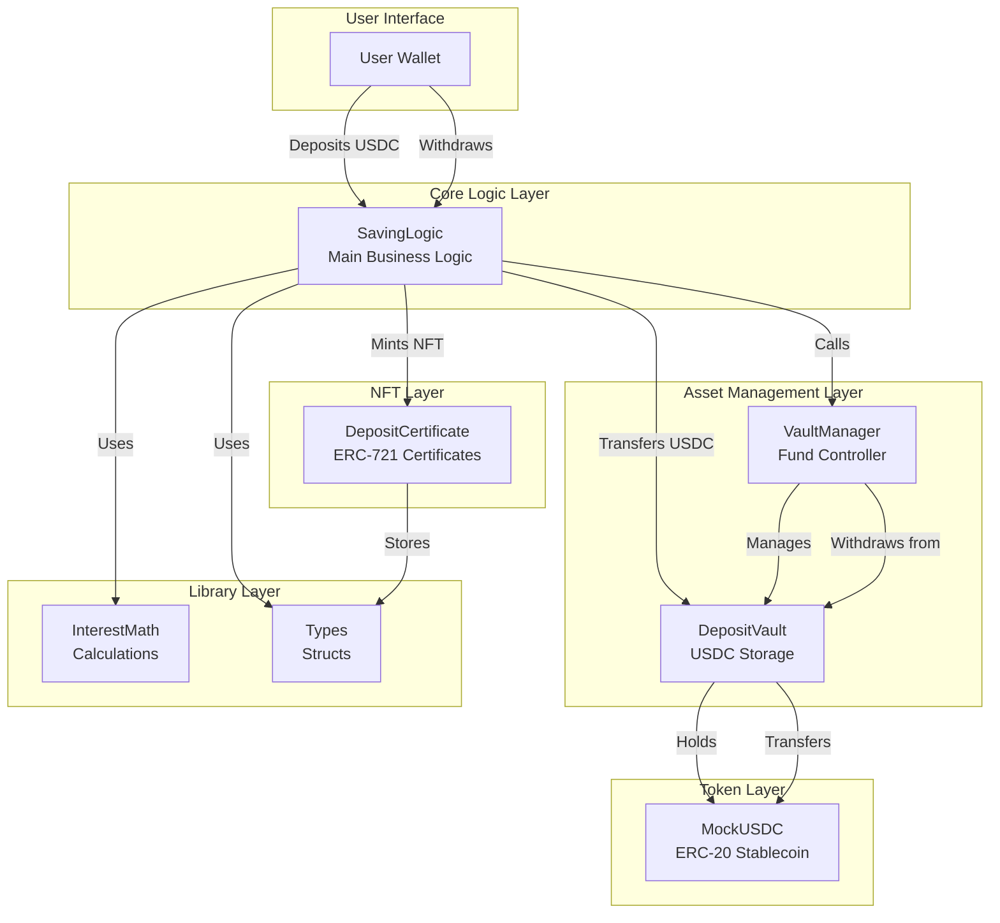
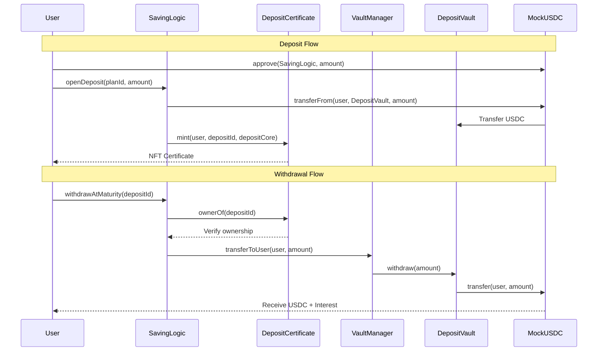
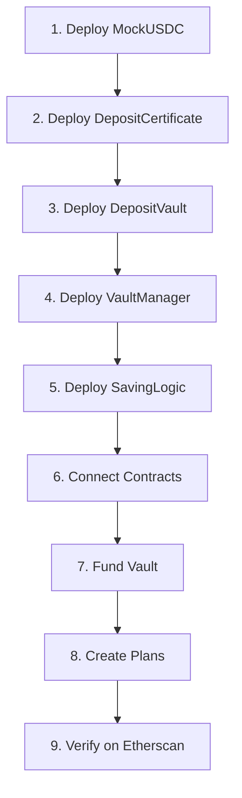

# 🔐 SMART CONTRACT ARCHITECTURE

**Project:** Term Deposit DApp  
**Version:** 2.0  
**Network:** Ethereum Sepolia Testnet  
**Solidity:** 0.8.28

---

## 📋 TABLE OF CONTENTS

1. [Contract Overview](#contract-overview)
2. [Architecture Diagram](#architecture-diagram)
3. [Contract Specifications](#contract-specifications)
4. [Security Model](#security-model)
5. [Function Reference](#function-reference)
6. [Event Reference](#event-reference)
7. [Deployment Guide](#deployment-guide)

---

## 📊 CONTRACT OVERVIEW

### System Components

| Contract | Purpose | Lines of Code | Test Coverage |
|----------|---------|---------------|---------------|
| **SavingLogic** | Core deposit logic | ~400 | 46 tests ✅ |
| **VaultManager** | Fund management | ~250 | 27 tests ✅ |
| **DepositCertificate** | NFT certificates | ~150 | Covered in SavingLogic |
| **DepositVault** | USDC storage | ~100 | Covered in VaultManager |
| **MockUSDC** | Test stablecoin | ~80 | 2 tests ✅ |
| **InterestMath** | Calculations | ~50 | Unit tested |
| **Types** | Shared structs | ~30 | N/A |

**Total:** ~1,060 lines of Solidity code  
**Test Suite:** 75 tests, 100% passing

---

## 🏗️ ARCHITECTURE DIAGRAM

### Contract Relationships



### Data Flow Architecture



---

## 📜 CONTRACT SPECIFICATIONS

### 1. SavingLogic

**Address:** `0xddEDe5D9F4005C1e5f84Cda022DB7e558177FEAb`

**Inheritance:**
```solidity
contract SavingLogic is Ownable, Pausable, ReentrancyGuard
```

**State Variables:**
```solidity
// Core components
IDepositCertificate public depositCertificate;
IDepositVault public depositVault;
IERC20 public usdcToken;

// Plan management
Plan[] public plans;
uint256 public nextDepositId;

// Mappings
mapping(address => uint256[]) private userDepositIds;
```

**Key Structs:**
```solidity
struct Plan {
    uint256 tenorSeconds;        // Lock period in seconds
    uint256 aprBps;              // Annual percentage rate (basis points)
    uint256 minDeposit;          // Minimum deposit amount (USDC wei)
    uint256 maxDeposit;          // Maximum deposit amount (USDC wei)
    uint256 penaltyBps;          // Early withdrawal penalty (basis points)
    bool isActive;               // Plan enabled/disabled
}

struct DepositCore {
    uint256 depositId;           // Unique identifier
    address owner;               // Deposit owner
    uint256 planId;              // Associated plan ID
    uint256 principal;           // Deposit amount
    uint256 aprBpsAtOpen;        // APR snapshot
    uint256 penaltyBpsAtOpen;    // Penalty snapshot
    uint256 startAt;             // Creation timestamp
    uint256 maturityAt;          // Maturity timestamp
    DepositStatus status;        // Current status
}

enum DepositStatus {
    Active,                      // 0: Currently locked
    Withdrawn,                   // 1: Withdrawn (maturity or early)
    ManualRenewed,               // 2: Manually renewed
    AutoRenewed                  // 3: Auto-renewed
}
```

**Access Control:**
- `onlyOwner`: createPlan, updatePlan, setPaused
- `whenNotPaused`: openDeposit, withdrawAtMaturity, earlyWithdraw
- `nonReentrant`: All state-changing functions

---

### 2. VaultManager

**Address:** `0xFf586ADCE68Ed8f0FcfbFA268Ba81E438900e136`

**Inheritance:**
```solidity
contract VaultManager is Ownable, Pausable
```

**State Variables:**
```solidity
IDepositVault public depositVault;
ISavingLogic public savingLogic;
IERC20 public usdcToken;
address public feeReceiver;
uint256 public totalPenaltiesCollected;
```

**Key Functions:**
```solidity
// Admin operations
function fundVault(uint256 amount) external onlyOwner
function withdrawFromVault(uint256 amount) external onlyOwner
function setFeeReceiver(address _feeReceiver) external onlyOwner

// SavingLogic operations
function transferToUser(address user, uint256 amount) external onlySavingLogic
function transferPenalty(uint256 amount) external onlySavingLogic

// Emergency controls
function pause() external onlyOwner
function unpause() external onlyOwner
```

---

### 3. DepositCertificate

**Address:** `0x2A4A34e3C69D862e1dAA94C64C5747f022160AB4`

**Inheritance:**
```solidity
contract DepositCertificate is ERC721, Ownable
```

**State Variables:**
```solidity
string private _baseTokenURI;
address public savingLogic;
mapping(uint256 => Types.DepositCore) private _depositCores;
```

**Key Functions:**
```solidity
// NFT operations
function mint(address to, uint256 depositId, Types.DepositCore memory depositCore) 
    external onlySavingLogic

function tokenURI(uint256 tokenId) public view override returns (string memory)

// Data access
function getDepositCore(uint256 depositId) external view returns (Types.DepositCore memory)

// Admin
function setBaseURI(string memory newBaseURI) external onlyOwner
```

---

### 4. DepositVault

**Address:** `0x077a4941565e0194a00Cd8DABE1acA09111F7B06`

**Purpose:** Isolated USDC storage vault

**State Variables:**
```solidity
IERC20 public usdcToken;
address public vaultManager;
```

**Key Functions:**
```solidity
function deposit(address from, uint256 amount) external returns (bool)
function withdraw(uint256 amount) external onlyVaultManager returns (bool)
function getBalance() external view returns (uint256)
```

---

### 5. MockUSDC

**Address:** `0x73a9bEc9B836007904A19C30B2FD9B2f7A6720BA`

**Inheritance:**
```solidity
contract MockUSDC is ERC20
```

**Features:**
- 6 decimals (like real USDC)
- 1,000,000 USDC initial supply
- Faucet function for testing

---

## 🔒 SECURITY MODEL

### Access Control Matrix

```mermaid
graph TB
    subgraph "Admin (Owner)"
        A1[Create/Update Plans]
        A2[Fund/Withdraw Vault]
        A3[Set Fee Receiver]
        A4[Pause/Unpause]
        A5[Update NFT URI]
    end
    
    subgraph "User"
        U1[Open Deposit]
        U2[Withdraw at Maturity]
        U3[Early Withdraw]
        U4[View Deposits]
    end
    
    subgraph "Contract (SavingLogic)"
        C1[Mint NFT]
        C2[Transfer from Vault]
        C3[Update Deposit Status]
    end
    
    OWNER[Contract Owner] -->|onlyOwner| A1
    OWNER -->|onlyOwner| A2
    OWNER -->|onlyOwner| A3
    OWNER -->|onlyOwner| A4
    OWNER -->|onlyOwner| A5
    
    USER[Any User] -->|whenNotPaused| U1
    USER -->|whenNotPaused + ownerOf| U2
    USER -->|whenNotPaused + ownerOf| U3
    USER -->|public view| U4
    
    SL[SavingLogic] -->|onlySavingLogic| C1
    SL -->|onlySavingLogic| C2
    SL -->|internal| C3
```



### Security Mechanisms

#### 1. Ownership Verification
```solidity
modifier onlyDepositOwner(uint256 depositId) {
    require(
        depositCertificate.ownerOf(depositId) == msg.sender,
        "SavingLogic: Not deposit owner"
    );
    _;
}
```

#### 2. Reentrancy Protection
```solidity
function withdrawAtMaturity(uint256 depositId) 
    external 
    nonReentrant 
    whenNotPaused 
    onlyDepositOwner(depositId)
{
    // Checks
    DepositCore memory deposit = depositCertificate.getDepositCore(depositId);
    require(deposit.status == DepositStatus.Active, "Already withdrawn");
    require(block.timestamp >= deposit.maturityAt, "Not matured");
    
    // Effects
    depositCertificate.updateStatus(depositId, DepositStatus.Withdrawn);
    
    // Interactions
    uint256 interest = InterestMath.calculateInterest(...);
    uint256 total = deposit.principal + interest;
    depositVault.transferToUser(msg.sender, total);
}
```

#### 3. APR Snapshot Protection
```solidity
// APR locked at deposit creation
depositCore.aprBpsAtOpen = plans[planId].aprBps;
depositCore.penaltyBpsAtOpen = plans[planId].penaltyBps;

// Admin changes don't affect existing deposits
```

#### 4. Pausable Pattern
```solidity
function pause() external onlyOwner {
    _pause();
}

function unpause() external onlyOwner {
    _unpause();
}

// All critical functions use whenNotPaused modifier
```

#### 5. Vault Isolation
```
┌─────────────────┐
│  SavingLogic    │ ← Business logic (no USDC)
└────────┬────────┘
         │
         ▼
┌─────────────────┐
│  VaultManager   │ ← Fund controller
└────────┬────────┘
         │
         ▼
┌─────────────────┐
│  DepositVault   │ ← USDC storage
└─────────────────┘
```

### Threat Mitigation

| Threat | Mitigation | Implementation |
|--------|------------|----------------|
| **Reentrancy** | ReentrancyGuard | All state-changing functions |
| **Unauthorized Withdrawal** | ownerOf() check | Modifier on withdraw functions |
| **APR Manipulation** | Snapshot at open | Store APR in DepositCore |
| **Vault Drain** | Access control | onlyVaultManager modifier |
| **Integer Overflow** | Solidity 0.8+ | Built-in checks |
| **Emergency Exploit** | Pausable | Admin can pause system |
| **Unauthorized Minting** | Access control | onlySavingLogic modifier |

---

## 📚 FUNCTION REFERENCE

### SavingLogic Functions

#### Admin Functions

**createPlan**
```solidity
function createPlan(
    uint256 tenorSeconds,
    uint256 aprBps,
    uint256 minDeposit,
    uint256 maxDeposit,
    uint256 penaltyBps
) external onlyOwner returns (uint256 planId)
```
Creates a new savings plan.

**updatePlan**
```solidity
function updatePlan(
    uint256 planId,
    uint256 tenorSeconds,
    uint256 aprBps,
    uint256 minDeposit,
    uint256 maxDeposit,
    uint256 penaltyBps,
    bool isActive
) external onlyOwner
```
Updates an existing plan (doesn't affect existing deposits).

#### User Functions

**openDeposit**
```solidity
function openDeposit(uint256 planId, uint256 amount) 
    external 
    whenNotPaused 
    nonReentrant 
    returns (uint256 depositId)
```
Opens a new deposit and mints NFT certificate.

**Requirements:**
- Plan must be active
- Amount >= minDeposit
- Amount <= maxDeposit
- User must have approved USDC

**withdrawAtMaturity**
```solidity
function withdrawAtMaturity(uint256 depositId) 
    external 
    whenNotPaused 
    nonReentrant 
    onlyDepositOwner(depositId)
```
Withdraws principal + interest at maturity.

**Requirements:**
- Caller must own NFT
- Deposit status == Active
- block.timestamp >= maturityAt

**earlyWithdraw**
```solidity
function earlyWithdraw(uint256 depositId) 
    external 
    whenNotPaused 
    nonReentrant 
    onlyDepositOwner(depositId)
```
Withdraws principal - penalty before maturity.

**Requirements:**
- Caller must own NFT
- Deposit status == Active
- block.timestamp < maturityAt

#### View Functions

**getPlan**
```solidity
function getPlan(uint256 planId) external view returns (Plan memory)
```

**getUserDepositIds**
```solidity
function getUserDepositIds(address user) external view returns (uint256[] memory)
```

**calculateInterest**
```solidity
function calculateInterest(uint256 depositId) public view returns (uint256)
```

---

## 📡 EVENT REFERENCE

### SavingLogic Events

```solidity
event PlanCreated(
    uint256 indexed planId,
    uint256 tenorSeconds,
    uint256 aprBps,
    uint256 minDeposit,
    uint256 maxDeposit,
    uint256 penaltyBps
);

event PlanUpdated(
    uint256 indexed planId,
    uint256 tenorSeconds,
    uint256 aprBps,
    uint256 minDeposit,
    uint256 maxDeposit,
    uint256 penaltyBps,
    bool isActive
);

event DepositOpened(
    uint256 indexed depositId,
    address indexed user,
    uint256 indexed planId,
    uint256 principal,
    uint256 maturityAt,
    uint256 aprBpsAtOpen
);

event DepositWithdrawn(
    uint256 indexed depositId,
    address indexed user,
    uint256 principal,
    uint256 interest,
    uint256 total
);

event EarlyWithdrawal(
    uint256 indexed depositId,
    address indexed user,
    uint256 principal,
    uint256 penalty,
    uint256 netAmount
);
```

### VaultManager Events

```solidity
event VaultFunded(address indexed funder, uint256 amount);
event VaultWithdrawn(address indexed recipient, uint256 amount);
event FeeReceiverUpdated(address indexed oldReceiver, address indexed newReceiver);
event PenaltyCollected(uint256 amount, address indexed feeReceiver);
```

### DepositCertificate Events

```solidity
event CertificateMinted(
    uint256 indexed tokenId,
    address indexed owner,
    uint256 indexed planId
);

event BaseURIUpdated(string newBaseURI);
```

---

## 🚀 DEPLOYMENT GUIDE

### Deployment Order



### Deployment Script

```bash
# 1. Set environment variables
export SEPOLIA_RPC_URL="https://eth-sepolia.g.alchemy.com/v2/YOUR_KEY"
export TESTNET_PRIVATE_KEY="0x..."
export ETHERSCAN_API_KEY="YOUR_KEY"

# 2. Deploy contracts
npx hardhat run deploy/deploy-v2-sepolia.ts --network sepolia

# 3. Verify contracts
npx hardhat run scripts/verify-contracts.ts --network sepolia

# 4. Create plans
npx hardhat run scripts/create-plans-sepolia.ts --network sepolia

# 5. Fund vault
npx hardhat run scripts/fund-vault.ts --network sepolia
```

### Post-Deployment Checklist

- [ ] All contracts deployed
- [ ] Contracts verified on Etherscan
- [ ] Contract connections established
- [ ] Vault funded with USDC
- [ ] Plans created
- [ ] NFT baseURI set
- [ ] Frontend .env updated
- [ ] Test deposit/withdrawal flow

---

## 📊 GAS OPTIMIZATION

### Gas Costs

| Function | Gas Used | Optimization |
|----------|----------|--------------|
| `openDeposit()` | ~150,000 | ✅ Minimal storage |
| `withdrawAtMaturity()` | ~100,000 | ✅ Single transfer |
| `earlyWithdraw()` | ~120,000 | ✅ Two transfers |
| `createPlan()` | ~80,000 | ✅ Struct packing |

### Optimization Techniques

1. **Struct Packing** - Variables ordered by size
2. **Event-based Queries** - Avoid storage iteration
3. **Minimal Storage Writes** - Cache in memory
4. **SafeERC20** - Efficient token transfers

---

## 🎯 BEST PRACTICES

### Development

- ✅ Use Hardhat for development
- ✅ Write comprehensive tests
- ✅ Follow Solidity style guide
- ✅ Use OpenZeppelin libraries
- ✅ Document with NatSpec

### Security

- ✅ External audit before mainnet
- ✅ Pausable for emergencies
- ✅ ReentrancyGuard on state changes
- ✅ Access control on sensitive functions
- ✅ Input validation

### Deployment

- ✅ Test on testnet first
- ✅ Verify contracts on Etherscan
- ✅ Use multisig for owner
- ✅ Monitor events
- ✅ Have upgrade plan

---

**Document Version:** 2.0  
**Last Updated:** January 31, 2026  
**Maintained By:** Tran Anh Thu
