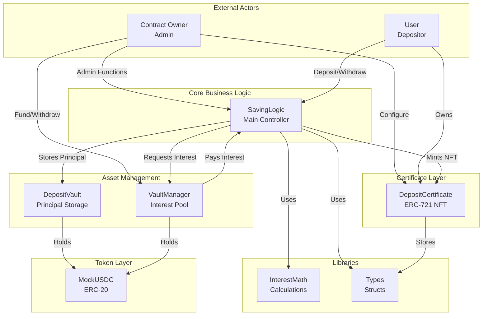
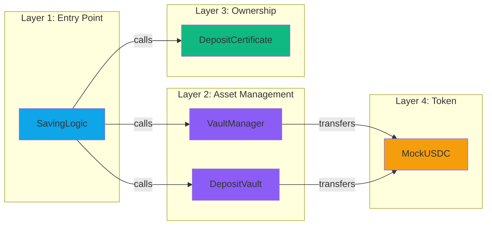
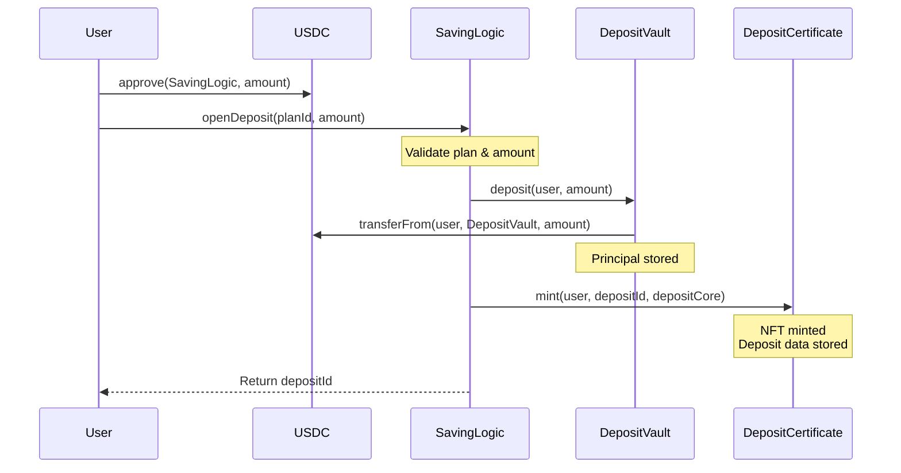
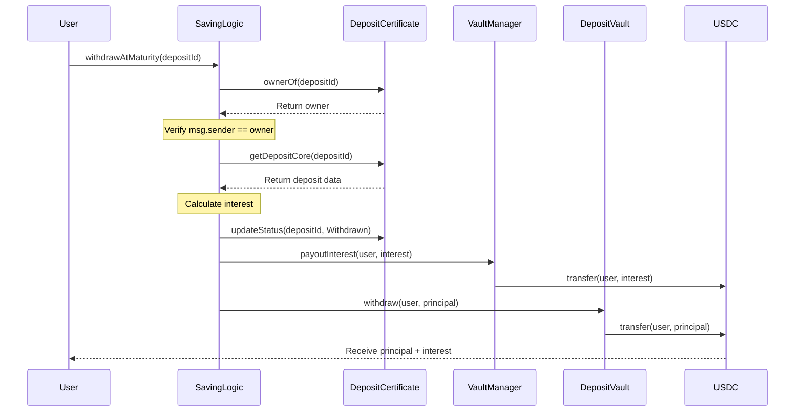
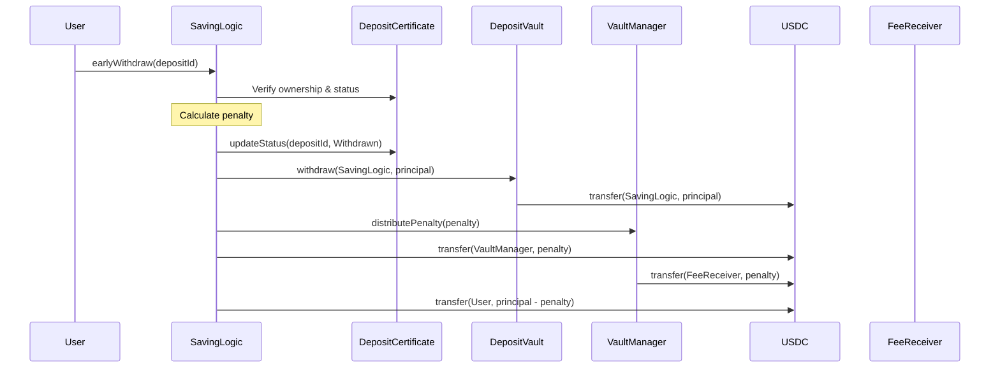
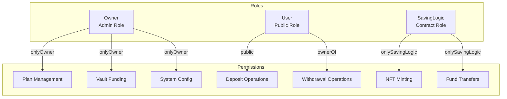

# 🔐 ON-CHAIN ARCHITECTURE - SMART CONTRACTS

**Project:** Term Deposit DApp - Blockchain Layer  
**Version:** 2.0  
**Solidity:** 0.8.20  
**Network:** Ethereum Sepolia Testnet

---

## 📋 TABLE OF CONTENTS

1. [High-Level Architecture](#high-level-architecture)
2. [Contract Relationships](#contract-relationships)
3. [Data Flow Architecture](#data-flow-architecture)
4. [Access Control Model](#access-control-model)
5. [Function Permission Matrix](#function-permission-matrix)
6. [State Management](#state-management)
7. [Security Mechanisms](#security-mechanisms)

---

## 🏗️ HIGH-LEVEL ARCHITECTURE

### System Overview



### Architectural Principles

#### 1. Separation of Concerns
```
SavingLogic (Business Logic) ≠ DepositVault (Fund Storage) ≠ VaultManager (Interest Pool)
```

**Why?**
- ✅ Security: Funds isolated from logic
- ✅ Upgradability: Can upgrade logic without moving funds
- ✅ Clarity: Each contract has single responsibility

#### 2. Dependency Injection
```solidity
constructor(
    address tokenAddress,
    address certificateAddress,
    address depositVaultAddress,
    address vaultManagerAddress,
    address initialOwner
)
```

**Benefits:**
- ✅ Testability: Easy to mock dependencies
- ✅ Flexibility: Can swap implementations
- ✅ Decoupling: Contracts don't create dependencies

#### 3. Immutable References
```solidity
IERC20 private immutable _token;
IDepositCertificate public immutable certificate;
IDepositVault public immutable depositVault;
```

**Advantages:**
- ✅ Gas savings: No SLOAD, uses constant
- ✅ Security: Cannot be changed after deployment
- ✅ Trust: Users know addresses won't change

---

## 🔗 CONTRACT RELATIONSHIPS

### Dependency Graph



### Contract Interfaces

#### SavingLogic → DepositCertificate
```solidity
interface IDepositCertificate {
    function mint(address to, uint256 depositId, Types.DepositCore memory depositCore) external;
    function updateStatus(uint256 depositId, Types.DepositStatus status) external;
    function getDepositCore(uint256 depositId) external view returns (Types.DepositCore memory);
    function ownerOf(uint256 tokenId) external view returns (address);
}
```

#### SavingLogic → DepositVault
```solidity
interface IDepositVault {
    function deposit(address from, uint256 amount) external returns (bool);
    function withdraw(address to, uint256 amount) external returns (bool);
    function getBalance() external view returns (uint256);
}
```

#### SavingLogic → VaultManager
```solidity
interface IVaultManager {
    function payoutInterest(address to, uint256 amount) external;
    function distributePenalty(uint256 amount) external;
}
```

---

## 🔄 DATA FLOW ARCHITECTURE

### 1. Open Deposit Flow



**Data Stored:**
- `DepositCertificate`: DepositCore struct (depositId, planId, principal, APR snapshot, maturity, status)
- `DepositVault`: USDC balance increased
- `SavingLogic`: Event emitted (DepositOpened)

### 2. Withdraw at Maturity Flow



**State Changes:**
- `DepositCertificate`: status = Withdrawn
- `VaultManager`: totalBalance -= interest
- `DepositVault`: USDC balance -= principal

### 3. Early Withdraw Flow



**Fund Flow:**
```
DepositVault → SavingLogic → Split:
  ├─> VaultManager → FeeReceiver (penalty)
  └─> User (principal - penalty)
```

---

## 🔐 ACCESS CONTROL MODEL

### Role-Based Access Control



### Modifier Hierarchy

#### 1. Ownable Pattern
```solidity
modifier onlyOwner() {
    _checkOwner();
    _;
}
```

**Applied to:**
- `SavingLogic`: createPlan, updatePlan, setGracePeriod, setVaultManager
- `VaultManager`: fundVault, withdrawVault, setFeeReceiver, setSavingLogic, pause, unpause
- `DepositCertificate`: setBaseURI, setSavingLogic

#### 2. Contract-Only Access
```solidity
modifier onlySavingLogic() {
    if (msg.sender != savingLogic) revert OnlySavingLogic();
    _;
}
```

**Applied to:**
- `DepositCertificate`: mint, updateStatus
- `VaultManager`: payoutInterest, distributePenalty
- `DepositVault`: withdraw

#### 3. Ownership Verification
```solidity
// Implicit check via ERC721.ownerOf()
address owner = certificate.ownerOf(depositId);
if (owner != msg.sender) revert NotDepositOwner();
```

**Applied to:**
- `SavingLogic`: withdrawAtMaturity, earlyWithdraw, renewDeposit, autoRenewDeposit

#### 4. Pausable Pattern
```solidity
modifier whenNotPaused() {
    _requireNotPaused();
    _;
}
```

**Applied to:**
- `VaultManager`: payoutInterest, distributePenalty

#### 5. ReentrancyGuard
```solidity
modifier nonReentrant() {
    _nonReentrantBefore();
    _;
    _nonReentrantAfter();
}
```

**Applied to:**
- `SavingLogic`: openDeposit, withdrawAtMaturity, earlyWithdraw, renewDeposit, autoRenewDeposit

---

## 📊 FUNCTION PERMISSION MATRIX

### SavingLogic Contract

| Function | Owner | User | SavingLogic | Modifiers | Description |
|----------|-------|------|-------------|-----------|-------------|
| **createPlan** | ✅ | ❌ | ❌ | `onlyOwner` | Create new savings plan |
| **updatePlan** | ✅ | ❌ | ❌ | `onlyOwner` | Update existing plan |
| **setGracePeriod** | ✅ | ❌ | ❌ | `onlyOwner` | Set auto-renew grace period |
| **setVaultManager** | ✅ | ❌ | ❌ | `onlyOwner` | Update VaultManager address |
| **openDeposit** | ✅ | ✅ | ❌ | `nonReentrant` | Open new deposit |
| **withdrawAtMaturity** | ✅* | ✅* | ❌ | `nonReentrant` | Withdraw at maturity |
| **earlyWithdraw** | ✅* | ✅* | ❌ | `nonReentrant` | Withdraw before maturity |
| **renewDeposit** | ✅* | ✅* | ❌ | `nonReentrant` | Manual renewal |
| **autoRenewDeposit** | ✅* | ✅* | ❌ | `nonReentrant` | Auto renewal after grace |
| **getPlan** | ✅ | ✅ | ✅ | `view` | Get plan details |
| **getDepositCore** | ✅ | ✅ | ✅ | `view` | Get deposit details |

*Only if caller owns the NFT certificate

### VaultManager Contract

| Function | Owner | User | SavingLogic | Modifiers | Description |
|----------|-------|------|-------------|-----------|-------------|
| **fundVault** | ✅ | ❌ | ❌ | `onlyOwner` | Add USDC to interest pool |
| **withdrawVault** | ✅ | ❌ | ❌ | `onlyOwner` | Remove USDC from pool |
| **setFeeReceiver** | ✅ | ❌ | ❌ | `onlyOwner` | Set penalty recipient |
| **setSavingLogic** | ✅ | ❌ | ❌ | `onlyOwner` | Set SavingLogic address |
| **pause** | ✅ | ❌ | ❌ | `onlyOwner` | Pause interest payouts |
| **unpause** | ✅ | ❌ | ❌ | `onlyOwner` | Unpause payouts |
| **payoutInterest** | ❌ | ❌ | ✅ | `onlySavingLogic`, `whenNotPaused` | Pay interest to user |
| **distributePenalty** | ❌ | ❌ | ✅ | `onlySavingLogic`, `whenNotPaused` | Send penalty to feeReceiver |
| **token** | ✅ | ✅ | ✅ | `view` | Get USDC address |
| **isPaused** | ✅ | ✅ | ✅ | `view` | Check pause status |

### DepositCertificate Contract

| Function | Owner | User | SavingLogic | Modifiers | Description |
|----------|-------|------|-------------|-----------|-------------|
| **mint** | ❌ | ❌ | ✅ | `onlySavingLogic` | Mint NFT certificate |
| **updateStatus** | ❌ | ❌ | ✅ | `onlySavingLogic` | Update deposit status |
| **setBaseURI** | ✅ | ❌ | ❌ | `onlyOwner` | Set metadata API URL |
| **setSavingLogic** | ✅ | ❌ | ❌ | `onlyOwner` | Set SavingLogic address |
| **tokenURI** | ✅ | ✅ | ✅ | `view` | Get metadata URL |
| **getDepositCore** | ✅ | ✅ | ✅ | `view` | Get deposit data |
| **ownerOf** | ✅ | ✅ | ✅ | `view` (ERC721) | Get NFT owner |
| **transferFrom** | ❌ | ✅* | ❌ | ERC721 | Transfer NFT |

*Only if caller owns or is approved for the NFT

### DepositVault Contract

| Function | Owner | User | SavingLogic | Modifiers | Description |
|----------|-------|------|-------------|-----------|-------------|
| **deposit** | ❌ | ❌ | ✅ | `onlySavingLogic` | Accept USDC deposit |
| **withdraw** | ❌ | ❌ | ✅ | `onlySavingLogic` | Transfer USDC out |
| **getBalance** | ✅ | ✅ | ✅ | `view` | Check vault balance |

### MockUSDC Contract

| Function | Owner | User | Contract | Modifiers | Description |
|----------|-------|------|----------|-----------|-------------|
| **transfer** | ✅ | ✅ | ✅ | ERC20 | Transfer USDC |
| **approve** | ✅ | ✅ | ✅ | ERC20 | Approve spender |
| **transferFrom** | ✅ | ✅ | ✅ | ERC20 | Transfer from approved |
| **mint** | ✅ | ❌ | ❌ | `onlyOwner` | Mint test USDC |
| **balanceOf** | ✅ | ✅ | ✅ | `view` | Check balance |

---

## 💾 STATE MANAGEMENT

### Storage Layout

#### SavingLogic State
```solidity
// Immutable (stored in bytecode)
IERC20 private immutable _token;
IDepositCertificate public immutable certificate;
IDepositVault public immutable depositVault;

// Mutable (stored in storage slots)
IVaultManager public vaultManager;              // Slot 0
uint256 public gracePeriod;                     // Slot 1
uint256 private _nextPlanId;                    // Slot 2
uint256 private _nextDepositId;                 // Slot 3
mapping(uint256 => Types.PlanCore) public plans; // Slot 4+
```

#### DepositCertificate State
```solidity
// ERC721 inherited state
mapping(uint256 => address) private _owners;
mapping(address => uint256) private _balances;
mapping(uint256 => address) private _tokenApprovals;
mapping(address => mapping(address => bool)) private _operatorApprovals;

// Custom state
string private _baseTokenURI;
address public savingLogic;
mapping(uint256 => Types.DepositCore) private _depositCores;
```

#### VaultManager State
```solidity
IERC20 private immutable _token;
address public feeReceiver;
address public savingLogic;
uint256 public totalBalance;
bool private _paused;
```

### Data Structures

#### PlanCore
```solidity
struct PlanCore {
    uint256 planId;                    // Unique plan ID
    uint32 tenorSeconds;               // Lock period (packed)
    uint16 aprBps;                     // APR in basis points (packed)
    uint256 minDeposit;                // Minimum deposit amount
    uint256 maxDeposit;                // Maximum deposit amount
    uint16 earlyWithdrawPenaltyBps;    // Penalty rate (packed)
    bool isActive;                     // Plan enabled/disabled
    uint256 createdAt;                 // Creation timestamp
}
```

#### DepositCore
```solidity
struct DepositCore {
    uint256 depositId;                 // Unique deposit ID
    uint256 planId;                    // Associated plan
    uint256 principal;                 // Deposit amount
    uint256 startAt;                   // Creation timestamp
    uint256 maturityAt;                // Maturity timestamp
    uint16 aprBpsAtOpen;               // APR snapshot (packed)
    uint16 penaltyBpsAtOpen;           // Penalty snapshot (packed)
    DepositStatus status;              // Current status (enum)
}

enum DepositStatus {
    Active,           // 0
    Withdrawn,        // 1
    ManualRenewed,    // 2
    AutoRenewed       // 3
}
```

---

## 🛡️ SECURITY MECHANISMS

### 1. Checks-Effects-Interactions Pattern

```solidity
function withdrawAtMaturity(uint256 depositId) external nonReentrant {
    // ✅ CHECKS
    Types.DepositCore memory depositCore = certificate.getDepositCore(depositId);
    address owner = _getOwner(depositId);
    if (owner != msg.sender) revert NotDepositOwner();
    if (depositCore.status != Types.DepositStatus.Active) revert DepositNotActive();
    if (block.timestamp < depositCore.maturityAt) revert NotYetMatured();
    
    // ✅ EFFECTS
    certificate.updateStatus(depositId, Types.DepositStatus.Withdrawn);
    
    // ✅ INTERACTIONS
    vaultManager.payoutInterest(msg.sender, interest);
    depositVault.withdraw(msg.sender, principal);
}
```

### 2. Reentrancy Protection

```solidity
// All state-changing functions use nonReentrant
function openDeposit(...) external nonReentrant { }
function withdrawAtMaturity(...) external nonReentrant { }
function earlyWithdraw(...) external nonReentrant { }
```

### 3. APR Snapshot Protection

```solidity
// APR locked at deposit creation
depositCore.aprBpsAtOpen = plan.aprBps;

// Admin updates don't affect existing deposits
function updatePlan(...) external onlyOwner {
    plan.aprBps = newAprBps; // Only affects NEW deposits
}
```

### 4. Fund Isolation

```
┌─────────────────────────────────────┐
│ SavingLogic (Business Logic)        │
│ - NO USDC storage                   │
│ - Only coordinates transfers        │
└─────────────────────────────────────┘
         │                  │
         ▼                  ▼
┌──────────────────┐  ┌──────────────────┐
│ DepositVault     │  │ VaultManager     │
│ (Principal)      │  │ (Interest)       │
│ - User funds     │  │ - Admin funds    │
│ - Isolated       │  │ - Pausable       │
└──────────────────┘  └──────────────────┘
```

### 5. Emergency Controls

```solidity
// VaultManager can be paused
function pause() external onlyOwner {
    _pause(); // Blocks payoutInterest & distributePenalty
}

// SavingLogic can be upgraded
function setVaultManager(address newVaultManager) external onlyOwner {
    vaultManager = IVaultManager(newVaultManager);
}
```

---

## 📈 GAS OPTIMIZATION

### Struct Packing

```solidity
// ✅ Optimized: 3 storage slots
struct PlanCore {
    uint256 planId;                    // Slot 0
    uint32 tenorSeconds;               // Slot 1 (4 bytes)
    uint16 aprBps;                     // Slot 1 (2 bytes)
    uint256 minDeposit;                // Slot 2
    uint256 maxDeposit;                // Slot 3
    uint16 earlyWithdrawPenaltyBps;    // Slot 1 (2 bytes)
    bool isActive;                     // Slot 1 (1 byte)
    uint256 createdAt;                 // Slot 4
}

// ❌ Unoptimized: Would use 8 slots if all uint256
```

### Immutable Variables

```solidity
// ✅ Gas savings: No SLOAD, uses constant
IERC20 private immutable _token;
IDepositCertificate public immutable certificate;
IDepositVault public immutable depositVault;
```

### Event-Based Queries

```solidity
// ✅ Frontend uses events instead of storage iteration
event DepositOpened(
    uint256 indexed depositId,
    address indexed user,
    uint256 indexed planId,
    uint256 principal,
    uint256 maturityAt,
    uint256 aprBpsAtOpen
);
```

---

## 🎯 DEPLOYMENT ADDRESSES (SEPOLIA)

| Contract | Address | Role |
|----------|---------|------|
| **MockUSDC** | `0x73a9bEc9B836007904A19C30B2FD9B2f7A6720BA` | Token |
| **DepositCertificate** | `0x2A4A34e3C69D862e1dAA94C64C5747f022160AB4` | NFT |
| **DepositVault** | `0x077a4941565e0194a00Cd8DABE1acA09111F7B06` | Principal Storage |
| **VaultManager** | `0xFf586ADCE68Ed8f0FcfbFA268Ba81E438900e136` | Interest Pool |
| **SavingLogic** | `0xddEDe5D9F4005C1e5f84Cda022DB7e558177FEAb` | Main Controller |

---

## 📝 CONCLUSION

This on-chain architecture provides:

- ✅ **Security** - Multiple layers of access control and protection
- ✅ **Modularity** - Clear separation of concerns
- ✅ **Upgradability** - Can upgrade logic without moving funds
- ✅ **Gas Efficiency** - Optimized storage and immutable references
- ✅ **Transparency** - All operations on-chain and verifiable

The system is production-ready for Ethereum mainnet after a professional security audit.

---

**Document Version:** 1.0  
**Last Updated:** January 31, 2026  
**Author:** Tran Anh Thu
