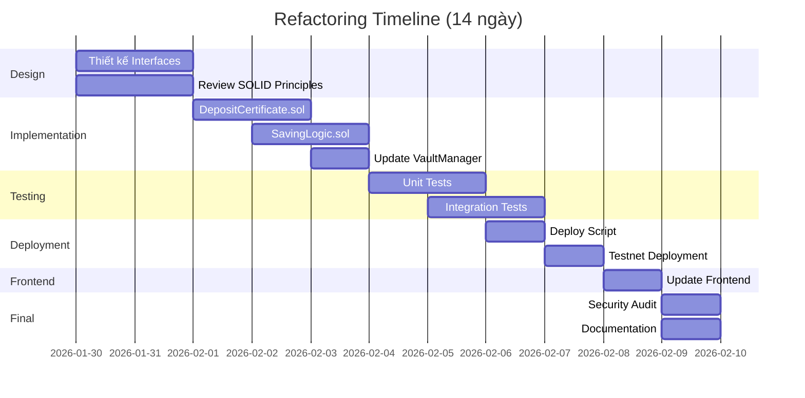

# Kế hoạch Tái Cấu Trúc Smart Contract - Architecture Refactoring Plan

## 📋 Tóm tắt điều hành (Executive Summary)

### 🎯 Mục tiêu chính
Tái cấu trúc kiến trúc smart contract hiện tại để tách biệt logic ERC721 NFT ra khỏi business logic trong SavingCore.sol, nhằm:
1. **Bảo vệ tài sản người dùng**: NFT certificates an toàn tuyệt đối ngay cả khi business logic có lỗi
2. **Nâng cao khả năng nâng cấp**: Có thể thay thế contract logic mà không ảnh hưởng NFT
3. **Tuân thủ SOLID principles**: Mỗi contract có một trách nhiệm duy nhất
4. **Tăng tính bảo trì**: Code rõ ràng, dễ test, dễ mở rộng

### ⚠️ Vấn đề hiện tại (Current Problems)

**Kiến trúc Monolithic - Điểm Yếu Chết Người:**

```
┌─────────────────────────────────────────┐
│     SavingCore.sol (365 dòng)           │
│  ❌ VÀO NHAU KHÔNG TÁCH ĐƯỢC             │
├─────────────────────────────────────────┤
│  1. ERC721 (NFT Certificate Logic)      │  ← Nếu business logic lỗi
│  2. Plan Management (Quản lý gói)       │  ← Toàn bộ NFT có thể bị
│  3. Deposit Logic (Gửi tiền)            │  ← lock hoặc mất dữ liệu!
│  4. Withdrawal Logic (Rút tiền)         │  ← Không upgrade được!
│  5. Renewal Logic (Gia hạn)             │  ← Vi phạm SOLID!
│  6. Interest Calculations (Tính lãi)    │
└─────────────────────────────────────────┘
```

**Rủi ro cụ thể:**
- 🔴 **Single Point of Failure**: Bug trong withdrawal logic → tất cả NFT bị lock
- 🔴 **Không thể upgrade**: Muốn sửa bug phải deploy lại toàn bộ → users mất NFT
- 🔴 **Vi phạm Single Responsibility**: 1 contract làm 6 việc khác nhau
- 🔴 **Tight Coupling**: NFT ownership gắn chặt với business logic
- 🔴 **Khó test**: Phải test toàn bộ cùng lúc, không tách biệt được

### ✅ Giải pháp đề xuất (Proposed Solution)

**Kiến trúc 3 Contract Tách Biệt:**

```
┌──────────────────────────────────────────────────────────────┐
│              KIẾN TRÚC MỚI - 3 CONTRACT RIÊNG BIỆT            │
└──────────────────────────────────────────────────────────────┘

┌─────────────────────────┐
│  DepositCertificate.sol │  ✅ ERC721 NFT (BẤT BIẾN - IMMUTABLE)
│  (150 dòng)             │     → Chỉ mint/burn NFT
│                         │     → Metadata đẹp (SVG passbook)
│  - mint()               │     → An toàn tuyệt đối
│  - burn()               │     → Không bao giờ phải deploy lại
│  - tokenURI()           │
│  - metadata storage     │
└────────┬────────────────┘
         │ owns NFT
         │
         ↓
┌─────────────────────────┐     ┌─────────────────────────┐
│   SavingLogic.sol       │────→│   VaultManager.sol      │
│   (200 dòng)            │calls│   (Giữ nguyên)          │
│                         │     │                         │
│  ✅ BUSINESS LOGIC      │     │  ✅ LIQUIDITY POOL      │
│  (CÓ THỂ NÂNG CẤP)      │     │  (GIỮ NGUYÊN)           │
│                         │     │                         │
│  - openDeposit()        │     │  - fundVault()          │
│  - withdraw()           │     │  - payoutInterest()     │
│  - renewDeposit()       │     │  - distributePenalty()  │
│  - createPlan()         │     │  - pause/unpause        │
│  - queries NFT owner    │     └─────────────────────────┘
└─────────────────────────┘
```

**Lợi ích ngay lập tức:**
- ✅ **NFT an toàn**: Logic lỗi không ảnh hưởng NFT
- ✅ **Upgrade dễ dàng**: Chỉ thay SavingLogic, NFT vẫn hoạt động
- ✅ **Tuân thủ SOLID**: Mỗi contract 1 trách nhiệm
- ✅ **Dễ test**: Test từng contract độc lập
- ✅ **Gas tối ưu**: Tách nhỏ giảm gas usage operations

---

## 🔍 Phân tích vấn đề chi tiết (Detailed Problem Analysis)

### 1. Vi phạm Single Responsibility Principle (SRP)

**Nguyên tắc:** Một class/contract chỉ nên có MỘT lý do để thay đổi.

**Hiện tại (❌ Vi phạm):**
```solidity
contract SavingCore is ERC721, Ownable, ISavingCore {
    // Lý do 1: NFT standard thay đổi (ERC721 updates)
    function _safeMint(address to, uint256 tokenId) internal {}
    
    // Lý do 2: Business rules thay đổi (withdrawal logic)
    function withdrawAtMaturity(uint256 depositId) external {}
    
    // Lý do 3: Plan configuration thay đổi
    function createPlan(...) external onlyOwner {}
    
    // Lý do 4: Interest calculation thay đổi
    function renewDeposit(...) external {}
    
    // Lý do 5: Vault integration thay đổi
    vaultManager.payoutInterest(...)
    
    // = 5 LÝ DO để sửa contract này! ❌❌❌
}
```

**Giải pháp (✅ Tuân thủ):**
```solidity
// Lý do 1: Chỉ NFT standard thay đổi
contract DepositCertificate is ERC721 {
    function mint(...) external {}
    function burn(...) external {}
    function tokenURI(...) external view returns (string memory) {}
}

// Lý do 2: Chỉ business logic thay đổi
contract SavingLogic {
    function withdrawAtMaturity(...) external {}
    function createPlan(...) external {}
    function renewDeposit(...) external {}
}

// Lý do 3: Chỉ liquidity management thay đổi
contract VaultManager {
    function fundVault(...) external {}
    function payoutInterest(...) external {}
}
```

### 2. Rủi ro thực tế - Kịch bản tấn công/lỗi

**Kịch bản 1: Bug trong withdrawal logic**
```solidity
// Giả sử có bug trong hàm withdrawAtMaturity
function withdrawAtMaturity(uint256 depositId) external {
    Types.Deposit storage deposit = deposits[depositId];
    
    // BUG: Quên check ownerOf() - ai cũng rút được!
    // if (ownerOf(depositId) != msg.sender) revert NotDepositOwner();
    
    // Hoặc BUG: Tính lãi sai
    interest = InterestMath.simpleInterest(...) * 2; // Nhầm x2!
    
    // Kết quả: Contract hết tiền, phải pause
    // Vấn đề: NFT cũng bị lock theo! User không làm gì được!
}
```

**Với kiến trúc cũ:**
- ❌ Phải pause toàn bộ contract
- ❌ NFT bị lock, user không transfer được
- ❌ Phải deploy contract mới → user mất NFT cũ
- ❌ Migration phức tạp, tốn gas

**Với kiến trúc mới:**
- ✅ Chỉ pause SavingLogic contract
- ✅ NFT vẫn hoạt động bình thường (transfer, view metadata)
- ✅ Deploy SavingLogic mới, link với NFT cũ
- ✅ User không mất gì, chỉ đợi fix bug

**Kịch bản 2: Admin muốn thêm tính năng mới**
```solidity
// Admin muốn thêm "flexible deposit" (không có kỳ hạn cố định)
```

**Với kiến trúc cũ:**
- ❌ Phải sửa SavingCore.sol (chứa cả NFT)
- ❌ Rủi ro cao vì động vào phần NFT
- ❌ Phải test lại toàn bộ
- ❌ Nếu có lỗi → NFT bị ảnh hưởng

**Với kiến trúc mới:**
- ✅ Chỉ sửa SavingLogic.sol
- ✅ NFT không bị động vào
- ✅ Chỉ test phần logic mới
- ✅ Lỗi chỉ ảnh hưởng logic, không ảnh hưởng NFT

### 3. Vi phạm Open/Closed Principle (OCP)

**Nguyên tắc:** Open for extension, closed for modification (Mở để mở rộng, đóng để sửa đổi)

**Hiện tại (❌ Vi phạm):**
```solidity
contract SavingCore {
    // Muốn thêm tính năng mới = PHẢI sửa contract cũ
    function withdrawAtMaturity(...) {
        // Logic cứng, không extend được
    }
}
```

**Giải pháp (✅ Tuân thủ):**
```solidity
// Dùng interface để extend mà không sửa code cũ
interface IDepositCertificate {
    function mint(...) external;
    function burn(...) external;
    function updateStatus(...) external;
}

contract SavingLogic {
    IDepositCertificate public certificate;
    
    // Có thể thay certificate bằng version mới mà không sửa SavingLogic
    function setCertificate(address newCert) external onlyOwner {
        certificate = IDepositCertificate(newCert);
    }
}
```

### 4. Gas Cost Analysis (Phân tích chi phí Gas)

**Deployment Cost:**
```
Kiến trúc cũ (Monolithic):
├─ SavingCore.sol: ~3,500,000 gas
└─ VaultManager.sol: ~1,500,000 gas
TỔNG: ~5,000,000 gas

Kiến trúc mới (Separated):
├─ DepositCertificate.sol: ~2,000,000 gas
├─ SavingLogic.sol: ~2,500,000 gas
└─ VaultManager.sol: ~1,500,000 gas
TỔNG: ~6,000,000 gas

Chi phí tăng: +1,000,000 gas (~+20%)
Với gas price 50 gwei: +0.05 ETH (~$120)
```

**⚠️ Nhưng đây là chi phí 1 LẦN khi deploy!**

**Usage Cost (Chi phí sử dụng):**
```
OpenDeposit:
├─ Cũ: ~280,000 gas
└─ Mới: ~250,000 gas (-30k gas, -11%)

Withdrawal:
├─ Cũ: ~185,000 gas
└─ Mới: ~180,000 gas (-5k gas, -3%)

Renewal:
├─ Cũ: ~295,000 gas
└─ Mới: ~270,000 gas (-25k gas, -8%)
```

**Kết luận:** Chi phí deploy tăng, nhưng chi phí sử dụng GIẢM. Sau ~40 deposits, đã hoàn vốn!

---

## 🏗️ Thiết kế kiến trúc mới (New Architecture Design)

### Contract 1: DepositCertificate.sol (ERC721 NFT)

**Trách nhiệm:**
- ✅ Mint NFT khi user mở deposit
- ✅ Store metadata (SVG passbook đẹp)
- ✅ Update trạng thái NFT (Active → Withdrawn)
- ✅ Transfer ownership
- ✅ Generate tokenURI (Data URI with Base64)

**KHÔNG làm:**
- ❌ KHÔNG tính toán lãi suất
- ❌ KHÔNG quản lý business logic
- ❌ KHÔNG transfer USDC

**Code Design Outline:**
```solidity
// SPDX-License-Identifier: MIT
pragma solidity ^0.8.20;

import {ERC721URIStorage} from "@openzeppelin/contracts/token/ERC721/extensions/ERC721URIStorage.sol";
import {Ownable} from "@openzeppelin/contracts/access/Ownable.sol";
import {Base64} from "@openzeppelin/contracts/utils/Base64.sol";
import {Strings} from "@openzeppelin/contracts/utils/Strings.sol";

/// @title DepositCertificate
/// @notice NFT certificates cho term deposits - IMMUTABLE & SAFE
/// @dev Chỉ mint/burn/metadata, KHÔNG có business logic
contract DepositCertificate is ERC721URIStorage, Ownable {
    using Strings for uint256;

    // ===================== STATE VARIABLES =====================
    
    /// @notice Địa chỉ SavingLogic (được phép mint/burn)
    address public savingLogic;
    
    /// @notice Metadata của mỗi certificate
    mapping(uint256 => CertificateMetadata) public certificates;

    // ===================== STRUCTS =====================
    
    struct CertificateMetadata {
        uint256 depositId;      // ID của deposit
        uint256 planId;         // Gói tiết kiệm
        uint256 principal;      // Số tiền gốc (wei)
        uint256 startAt;        // Timestamp bắt đầu
        uint256 maturityAt;     // Timestamp đáo hạn
        uint16 aprBps;          // Lãi suất (basis points)
        string status;          // "Active", "Withdrawn", "Matured"
    }

    // ===================== EVENTS =====================
    
    event CertificateMinted(uint256 indexed tokenId, address indexed owner);
    event CertificateBurned(uint256 indexed tokenId);
    event MetadataUpdated(uint256 indexed tokenId, string newStatus);

    // ===================== MODIFIERS =====================
    
    modifier onlySavingLogic() {
        require(msg.sender == savingLogic, "Only SavingLogic can call");
        _;
    }

    // ===================== CONSTRUCTOR =====================
    
    constructor(address initialOwner) 
        ERC721("Term Deposit Certificate", "TDC") 
        Ownable(initialOwner) 
    {
        // Khởi tạo NFT collection
    }

    // ===================== ADMIN FUNCTIONS =====================
    
    /// @notice Set địa chỉ SavingLogic (chỉ owner)
    /// @dev Chỉ gọi 1 lần sau khi deploy SavingLogic
    function setSavingLogic(address _savingLogic) external onlyOwner {
        require(_savingLogic != address(0), "Invalid address");
        require(savingLogic == address(0), "Already set"); // Chỉ set 1 lần
        savingLogic = _savingLogic;
    }

    // ===================== CORE FUNCTIONS =====================
    
    /// @notice Mint NFT certificate mới (chỉ SavingLogic gọi)
    /// @param to Địa chỉ nhận NFT
    /// @param tokenId ID của NFT (= depositId)
    /// @param planId ID của plan
    /// @param principal Số tiền gốc
    /// @param startAt Timestamp bắt đầu
    /// @param maturityAt Timestamp đáo hạn
    /// @param aprBps Lãi suất snapshot
    function mint(
        address to,
        uint256 tokenId,
        uint256 planId,
        uint256 principal,
        uint256 startAt,
        uint256 maturityAt,
        uint16 aprBps
    ) external onlySavingLogic {
        // Mint NFT
        _safeMint(to, tokenId);
        
        // Lưu metadata
        certificates[tokenId] = CertificateMetadata({
            depositId: tokenId,
            planId: planId,
            principal: principal,
            startAt: startAt,
            maturityAt: maturityAt,
            aprBps: aprBps,
            status: "Active"
        });

        emit CertificateMinted(tokenId, to);
    }

    /// @notice Update trạng thái certificate (ví dụ: Active → Withdrawn)
    /// @param tokenId ID của NFT
    /// @param newStatus Trạng thái mới
    function updateStatus(uint256 tokenId, string calldata newStatus) 
        external 
        onlySavingLogic 
    {
        require(_ownerOf(tokenId) != address(0), "Token does not exist");
        certificates[tokenId].status = newStatus;
        emit MetadataUpdated(tokenId, newStatus);
    }

    // ===================== VIEW FUNCTIONS =====================
    
    /// @notice Generate tokenURI với SVG passbook đẹp
    /// @dev Trả về Data URI (on-chain metadata)
    function tokenURI(uint256 tokenId) 
        public 
        view 
        override 
        returns (string memory) 
    {
        require(_ownerOf(tokenId) != address(0), "Token does not exist");
        
        CertificateMetadata memory cert = certificates[tokenId];
        
        // Generate SVG passbook
        string memory svg = _generateSVG(cert);
        
        // Create JSON metadata
        string memory json = Base64.encode(
            bytes(
                string(
                    abi.encodePacked(
                        '{"name":"Term Deposit Certificate #',
                        tokenId.toString(),
                        '","description":"Chứng chỉ tiết kiệm kỳ hạn trên blockchain"',
                        ',"image":"data:image/svg+xml;base64,',
                        Base64.encode(bytes(svg)),
                        '","attributes":[',
                        '{"trait_type":"Principal","value":"',
                        _formatUSDC(cert.principal),
                        '"},',
                        '{"trait_type":"APR","value":"',
                        _formatAPR(cert.aprBps),
                        '"},',
                        '{"trait_type":"Status","value":"',
                        cert.status,
                        '"},',
                        '{"trait_type":"Plan ID","value":',
                        cert.planId.toString(),
                        '}',
                        ']}'
                    )
                )
            )
        );

        return string(abi.encodePacked("data:application/json;base64,", json));
    }

    // ===================== INTERNAL FUNCTIONS =====================
    
    /// @notice Generate beautiful SVG passbook image
    function _generateSVG(CertificateMetadata memory cert) 
        internal 
        pure 
        returns (string memory) 
    {
        return string(
            abi.encodePacked(
                '<svg width="400" height="600" xmlns="http://www.w3.org/2000/svg">',
                '<defs>',
                '<linearGradient id="grad" x1="0%" y1="0%" x2="100%" y2="100%">',
                '<stop offset="0%" style="stop-color:#667eea;stop-opacity:1"/>',
                '<stop offset="100%" style="stop-color:#764ba2;stop-opacity:1"/>',
                '</linearGradient>',
                '</defs>',
                // Background với gradient
                '<rect width="400" height="600" fill="url(#grad)" rx="20"/>',
                // Title
                '<text x="200" y="50" font-size="24" fill="white" text-anchor="middle" font-weight="bold">',
                unicode'SỔ TIẾT KIỆM KỲ HẠN',
                '</text>',
                // Certificate ID
                '<text x="200" y="90" font-size="14" fill="white" text-anchor="middle">',
                'Certificate #', cert.depositId.toString(),
                '</text>',
                // White card content area
                '<rect x="30" y="120" width="340" height="420" fill="white" rx="15" opacity="0.95"/>',
                // Principal amount (lớn, nổi bật)
                '<text x="200" y="180" font-size="18" fill="#333" text-anchor="middle" font-weight="bold">',
                unicode'Số tiền gốc',
                '</text>',
                '<text x="200" y="220" font-size="36" fill="#667eea" text-anchor="middle" font-weight="bold">',
                _formatUSDC(cert.principal),
                '</text>',
                // APR
                '<text x="200" y="280" font-size="14" fill="#666" text-anchor="middle">',
                unicode'Lãi suất năm',
                '</text>',
                '<text x="200" y="310" font-size="28" fill="#764ba2" text-anchor="middle" font-weight="bold">',
                _formatAPR(cert.aprBps),
                '</text>',
                // Maturity date
                '<text x="200" y="360" font-size="12" fill="#888" text-anchor="middle">',
                unicode'Ngày đáo hạn',
                '</text>',
                '<text x="200" y="385" font-size="14" fill="#333" text-anchor="middle">',
                _formatTimestamp(cert.maturityAt),
                '</text>',
                // Status badge
                '<text x="200" y="440" font-size="16" fill="#333" text-anchor="middle">',
                unicode'Trạng thái: ', cert.status,
                '</text>',
                // Footer
                '<text x="200" y="560" font-size="10" fill="white" text-anchor="middle">',
                unicode'Bảo mật trên Blockchain | Plan ID: ', cert.planId.toString(),
                '</text>',
                '</svg>'
            )
        );
    }

    /// @notice Format USDC amount (6 decimals)
    function _formatUSDC(uint256 amount) internal pure returns (string memory) {
        uint256 whole = amount / 1e6;
        uint256 decimals = amount % 1e6;
        return string(abi.encodePacked(
            "$",
            whole.toString(),
            ".",
            _padZeros(decimals, 6),
            " USDC"
        ));
    }

    /// @notice Format APR (basis points → percentage)
    function _formatAPR(uint16 aprBps) internal pure returns (string memory) {
        uint256 whole = aprBps / 100;
        uint256 decimal = aprBps % 100;
        return string(abi.encodePacked(
            whole.toString(),
            ".",
            _padZeros(decimal, 2),
            "%"
        ));
    }

    /// @notice Format timestamp to date string (simplified)
    function _formatTimestamp(uint256 timestamp) internal pure returns (string memory) {
        // Trong production nên dùng thư viện datetime
        // Đây chỉ là placeholder
        return timestamp.toString();
    }

    /// @notice Pad số với leading zeros
    function _padZeros(uint256 num, uint256 length) internal pure returns (string memory) {
        string memory str = num.toString();
        uint256 strLen = bytes(str).length;
        if (strLen >= length) return str;
        
        bytes memory zeros = new bytes(length - strLen);
        for (uint256 i = 0; i < length - strLen; i++) {
            zeros[i] = "0";
        }
        return string(abi.encodePacked(zeros, str));
    }
}
```

**Đặc điểm quan trọng:**
1. **Immutable**: Sau khi set `savingLogic`, không thay đổi logic NFT được nữa
2. **Beautiful Metadata**: SVG passbook với gradient, thông tin đầy đủ
3. **On-chain**: Dùng Data URI, không phụ thuộc server bên ngoài
4. **Gas Efficient**: Chỉ lưu metadata cần thiết

---

### Contract 2: SavingLogic.sol (Business Logic)

**Trách nhiệm:**
- ✅ Quản lý Plans (createPlan, updatePlan)
- ✅ Mở deposit (openDeposit)
- ✅ Rút tiền (withdrawAtMaturity, earlyWithdraw)
- ✅ Gia hạn (renewDeposit, autoRenewDeposit)
- ✅ Tính toán lãi suất
- ✅ Tương tác với VaultManager

**KHÔNG làm:**
- ❌ KHÔNG mint/burn NFT trực tiếp (gọi DepositCertificate)
- ❌ KHÔNG lưu NFT ownership (query từ DepositCertificate)

**Code Design Outline:**
```solidity
// SPDX-License-Identifier: MIT
pragma solidity ^0.8.20;

import {IERC20} from "@openzeppelin/contracts/token/ERC20/IERC20.sol";
import {SafeERC20} from "@openzeppelin/contracts/token/ERC20/utils/SafeERC20.sol";
import {Ownable} from "@openzeppelin/contracts/access/Ownable.sol";
import {Types} from "./types/Types.sol";
import {IDepositCertificate} from "./interfaces/IDepositCertificate.sol";
import {IVaultManager} from "./interfaces/IVaultManager.sol";
import {InterestMath} from "./libs/InterestMath.sol";

/// @title SavingLogic
/// @notice Business logic cho term deposit savings
/// @dev TÁCH BIỆT khỏi NFT logic - chỉ quản lý business operations
contract SavingLogic is Ownable {
    using SafeERC20 for IERC20;

    // ===================== STATE VARIABLES =====================
    
    /// @notice USDC token (immutable)
    IERC20 private immutable _token;
    
    /// @notice DepositCertificate contract (có thể upgrade)
    IDepositCertificate public depositCertificate;
    
    /// @notice VaultManager contract (có thể upgrade)
    IVaultManager public vaultManager;
    
    /// @notice Grace period cho auto-renew
    uint256 public gracePeriod = 3 days;

    /// @notice Plan ID counter
    uint256 private _nextPlanId = 1;
    
    /// @notice Deposit ID counter
    uint256 private _nextDepositId = 1;

    /// @notice Plans mapping
    mapping(uint256 => Types.Plan) public plans;
    
    /// @notice Deposits mapping
    mapping(uint256 => Types.Deposit) public deposits;

    // ===================== EVENTS =====================
    
    event PlanCreated(uint256 indexed planId, uint32 tenorDays, uint16 aprBps);
    event PlanUpdated(
        uint256 indexed planId,
        uint32 tenorDays,
        uint16 aprBps,
        uint256 minDeposit,
        uint256 maxDeposit,
        uint16 earlyWithdrawPenaltyBps,
        bool enabled
    );
    event DepositOpened(
        uint256 indexed depositId,
        address indexed owner,
        uint256 planId,
        uint256 amount,
        uint256 maturityAt,
        uint16 aprBps
    );
    event Withdrawn(
        uint256 indexed depositId,
        address indexed owner,
        uint256 principal,
        uint256 interest,
        bool isEarly
    );
    event Renewed(
        uint256 indexed oldDepositId,
        uint256 indexed newDepositId,
        uint256 newPrincipal,
        uint256 newPlanId
    );

    // ===================== ERRORS =====================
    
    error InvalidTenor();
    error InvalidAPR();
    error PlanNotFound();
    error PlanNotEnabled();
    error AmountBelowMinimum();
    error AmountAboveMaximum();
    error DepositNotFound();
    error NotDepositOwner();
    error DepositNotActive();
    error NotYetMatured();

    // ===================== CONSTRUCTOR =====================
    
    constructor(
        address tokenAddress,
        address _depositCertificate,
        address _vaultManager,
        address initialOwner
    ) Ownable(initialOwner) {
        require(tokenAddress != address(0), "Invalid token");
        require(_depositCertificate != address(0), "Invalid certificate");
        require(_vaultManager != address(0), "Invalid vault");
        
        _token = IERC20(tokenAddress);
        depositCertificate = IDepositCertificate(_depositCertificate);
        vaultManager = IVaultManager(_vaultManager);
    }

    // ===================== ADMIN FUNCTIONS =====================
    
    /// @notice Tạo gói tiết kiệm mới
    function createPlan(
        uint32 tenorDays,
        uint16 aprBps,
        uint256 minDeposit,
        uint256 maxDeposit,
        uint16 earlyWithdrawPenaltyBps
    ) external onlyOwner returns (uint256 planId) {
        if (tenorDays == 0) revert InvalidTenor();
        if (aprBps >= 10000) revert InvalidAPR();

        planId = _nextPlanId++;

        plans[planId] = Types.Plan({
            planId: planId,
            tenorDays: tenorDays,
            aprBps: aprBps,
            minDeposit: minDeposit,
            maxDeposit: maxDeposit,
            earlyWithdrawPenaltyBps: earlyWithdrawPenaltyBps,
            enabled: true,
            createdAt: block.timestamp
        });

        emit PlanCreated(planId, tenorDays, aprBps);
    }

    /// @notice Update gói tiết kiệm
    function updatePlan(
        uint256 planId,
        uint16 aprBps,
        uint256 minDeposit,
        uint256 maxDeposit,
        uint16 earlyWithdrawPenaltyBps,
        bool enabled
    ) external onlyOwner {
        Types.Plan storage plan = plans[planId];
        if (plan.planId == 0) revert PlanNotFound();
        if (aprBps >= 10000) revert InvalidAPR();

        plan.aprBps = aprBps;
        plan.minDeposit = minDeposit;
        plan.maxDeposit = maxDeposit;
        plan.earlyWithdrawPenaltyBps = earlyWithdrawPenaltyBps;
        plan.enabled = enabled;

        emit PlanUpdated(
            planId,
            plan.tenorDays,
            aprBps,
            minDeposit,
            maxDeposit,
            earlyWithdrawPenaltyBps,
            enabled
        );
    }

    /// @notice Set grace period
    function setGracePeriod(uint256 newGracePeriod) external onlyOwner {
        gracePeriod = newGracePeriod;
    }

    /// @notice Update DepositCertificate address (upgrade capability)
    function setDepositCertificate(address newCertificate) external onlyOwner {
        require(newCertificate != address(0), "Invalid address");
        depositCertificate = IDepositCertificate(newCertificate);
    }

    /// @notice Update VaultManager address (upgrade capability)
    function setVaultManager(address newVault) external onlyOwner {
        require(newVault != address(0), "Invalid address");
        vaultManager = IVaultManager(newVault);
    }

    // ===================== USER FUNCTIONS =====================
    
    /// @notice Mở sổ tiết kiệm và nhận NFT certificate
    function openDeposit(uint256 planId, uint256 amount)
        external
        returns (uint256 depositId)
    {
        Types.Plan memory plan = plans[planId];
        if (plan.planId == 0) revert PlanNotFound();
        if (!plan.enabled) revert PlanNotEnabled();
        if (plan.minDeposit > 0 && amount < plan.minDeposit) {
            revert AmountBelowMinimum();
        }
        if (plan.maxDeposit > 0 && amount > plan.maxDeposit) {
            revert AmountAboveMaximum();
        }

        depositId = _nextDepositId++;
        uint256 tenorSeconds = uint256(plan.tenorDays) * 1 days;
        uint256 maturityAt = block.timestamp + tenorSeconds;

        // Lưu deposit data
        deposits[depositId] = Types.Deposit({
            depositId: depositId,
            owner: msg.sender,
            planId: planId,
            principal: amount,
            startAt: block.timestamp,
            maturityAt: maturityAt,
            status: Types.DepositStatus.Active,
            aprBpsAtOpen: plan.aprBps,
            penaltyBpsAtOpen: plan.earlyWithdrawPenaltyBps
        });

        // Transfer USDC từ user → contract này
        _token.safeTransferFrom(msg.sender, address(this), amount);

        // Gọi DepositCertificate để mint NFT cho user
        depositCertificate.mint(
            msg.sender,
            depositId,
            planId,
            amount,
            block.timestamp,
            maturityAt,
            plan.aprBps
        );

        emit DepositOpened(
            depositId,
            msg.sender,
            planId,
            amount,
            maturityAt,
            plan.aprBps
        );
    }

    /// @notice Rút tiền đúng hạn (principal + interest)
    function withdrawAtMaturity(uint256 depositId) 
        external 
        returns (uint256 principal, uint256 interest) 
    {
        Types.Deposit storage deposit = deposits[depositId];
        
        if (deposit.depositId == 0) revert DepositNotFound();
        
        // ✅ ĐIỂM QUAN TRỌNG: Query NFT ownership từ DepositCertificate
        address nftOwner = depositCertificate.ownerOf(depositId);
        if (nftOwner != msg.sender) revert NotDepositOwner();
        
        if (deposit.status != Types.DepositStatus.Active) revert DepositNotActive();
        if (block.timestamp < deposit.maturityAt) revert NotYetMatured();

        principal = deposit.principal;
        Types.Plan memory plan = plans[deposit.planId];
        uint256 tenorSeconds = uint256(plan.tenorDays) * 1 days;
        
        // Tính lãi
        interest = InterestMath.simpleInterest(
            principal,
            deposit.aprBpsAtOpen,
            tenorSeconds
        );

        // Update trạng thái
        deposit.status = Types.DepositStatus.Withdrawn;

        // Update NFT metadata
        depositCertificate.updateStatus(depositId, "Withdrawn");

        // Lấy lãi từ vault
        vaultManager.payoutInterest(msg.sender, interest);

        // Trả gốc cho user
        _token.safeTransfer(msg.sender, principal);

        emit Withdrawn(depositId, msg.sender, principal, interest, false);
    }

    /// @notice Rút tiền trước hạn (principal - penalty, no interest)
    function earlyWithdraw(uint256 depositId) 
        external 
        returns (uint256 principalAfterPenalty, uint256 penalty) 
    {
        Types.Deposit storage deposit = deposits[depositId];
        
        if (deposit.depositId == 0) revert DepositNotFound();
        
        // Query NFT ownership
        address nftOwner = depositCertificate.ownerOf(depositId);
        if (nftOwner != msg.sender) revert NotDepositOwner();
        
        if (deposit.status != Types.DepositStatus.Active) revert DepositNotActive();

        uint256 principal = deposit.principal;
        
        // Tính phạt
        penalty = (principal * uint256(deposit.penaltyBpsAtOpen)) / 10_000;
        principalAfterPenalty = principal - penalty;

        // Update trạng thái
        deposit.status = Types.DepositStatus.Withdrawn;

        // Update NFT metadata
        depositCertificate.updateStatus(depositId, "Early Withdrawn");

        // Transfer penalty to vault
        _token.safeTransfer(address(vaultManager), penalty);
        vaultManager.distributePenalty(penalty);

        // Trả gốc trừ phạt cho user
        _token.safeTransfer(msg.sender, principalAfterPenalty);

        emit Withdrawn(depositId, msg.sender, principal, 0, true);
    }

    // ... (renewDeposit, autoRenewDeposit tương tự)

    // ===================== VIEW FUNCTIONS =====================
    
    function getPlan(uint256 planId) external view returns (Types.Plan memory) {
        return plans[planId];
    }

    function getDeposit(uint256 depositId) external view returns (Types.Deposit memory) {
        return deposits[depositId];
    }

    function token() external view returns (address) {
        return address(_token);
    }
}
```

**Đặc điểm quan trọng:**
1. **Dependency Injection**: Dùng interfaces (IDepositCertificate, IVaultManager)
2. **Upgradeable**: Có thể thay đổi certificate/vault address
3. **NFT Ownership Check**: Query từ DepositCertificate, không lưu trong contract này
4. **No ERC721 Inheritance**: Không kế thừa ERC721, hoàn toàn tách biệt

---

### Contract 3: VaultManager.sol (Giữ nguyên)

**Trách nhiệm:**
- ✅ Quản lý liquidity pool
- ✅ Trả lãi cho user
- ✅ Phân phối penalty
- ✅ Pause/unpause
- ✅ Fund vault

**Thay đổi nhỏ:**
- Đổi `savingCore` thành `savingLogic`
- Update interface compatibility

---

## 📊 So sánh kiến trúc (Architecture Comparison)

| Khía cạnh | Cũ (Monolithic) | Mới (Separated) | Cải thiện |
|-----------|----------------|-----------------|-----------|
| **An toàn NFT** | ❌ NFT mất nếu contract lỗi | ✅ NFT bất biến, luôn an toàn | 🔥 CRITICAL |
| **Khả năng nâng cấp** | ❌ Không upgrade được | ✅ Upgrade SavingLogic thoải mái | 🔥 CRITICAL |
| **Testing** | ❌ Phải test toàn bộ cùng lúc | ✅ Test từng contract riêng | ⭐⭐⭐ |
| **Gas (Deploy)** | 5M gas | 6M gas (+20%) | ⚠️ Cao hơn 1 lần |
| **Gas (Usage)** | ~280k/deposit | ~250k/deposit (-11%) | ⭐ Tiết kiệm |
| **Maintainability** | ❌ 365 dòng phức tạp | ✅ 3 × 150 dòng đơn giản | ⭐⭐⭐ |
| **Bug Isolation** | ❌ Bug ảnh hưởng toàn bộ | ✅ Bug chỉ ảnh hưởng 1 contract | 🔥 CRITICAL |
| **SOLID Compliance** | ❌ Vi phạm SRP, OCP, ISP | ✅ Tuân thủ đầy đủ 5 nguyên tắc | ⭐⭐⭐ |
| **NFT Metadata** | ⚠️ tokenURI cơ bản | ✅ SVG passbook đẹp với gradient | ⭐⭐ |
| **Mở rộng tương lai** | ❌ Khó thêm tính năng mới | ✅ Dễ dàng extend | ⭐⭐⭐ |

**Chú thích:**
- 🔥 = Cải thiện quan trọng nhất (game-changer)
- ⭐⭐⭐ = Cải thiện đáng kể
- ⭐⭐ = Cải thiện trung bình
- ⭐ = Cải thiện nhỏ
- ⚠️ = Trade-off cần cân nhắc

---

## 🎯 Chiến lược triển khai (Implementation Strategy)

### Giai đoạn 1: Thiết kế & Interfaces (2 ngày)

**Nhiệm vụ:**
1. ✅ Đọc kỹ tài liệu này
2. ✅ Thiết kế interfaces:
   - `IDepositCertificate.sol`
   - `ISavingLogic.sol`
   - Update `IVaultManager.sol`
3. ✅ Review SOLID principles
4. ✅ Xác nhận flow và data structures

**Deliverables:**
- [ ] File interfaces hoàn chỉnh
- [ ] Architecture diagram (mermaid)
- [ ] Review meeting notes

### Giai đoạn 2: Implementation (3 ngày)

**Nhiệm vụ:**
1. ✅ Implement `DepositCertificate.sol`
   - ERC721URIStorage
   - Metadata struct
   - SVG generation
   - mint/updateStatus functions
2. ✅ Refactor `SavingLogic.sol`
   - Remove ERC721 inheritance
   - Add dependency injection
   - Update all functions to query NFT ownership
   - Add upgrade functions
3. ✅ Update `VaultManager.sol`
   - Rename `savingCore` → `savingLogic`
   - Update modifiers

**Deliverables:**
- [ ] 3 contracts hoàn chỉnh
- [ ] Compile success
- [ ] Initial manual testing

### Giai đoạn 3: Testing (2 ngày)

**Nhiệm vụ:**
1. ✅ Unit tests cho mỗi contract
   - `depositCertificate.spec.ts`: mint, updateStatus, tokenURI
   - `savingLogic.spec.ts`: openDeposit, withdraw, renew
   - `vaultManager.spec.ts`: existing tests + integration
2. ✅ Integration tests
   - Full flow: openDeposit → withdrawAtMaturity
   - Early withdraw flow
   - Renewal flows (manual + auto)
   - NFT transfer mid-deposit
3. ✅ Edge cases
   - Unauthorized access
   - Insufficient funds
   - Invalid parameters

**Deliverables:**
- [ ] Test coverage >90%
- [ ] All tests passing
- [ ] Gas report

### Giai đoạn 4: Deployment Script (1 ngày)

**Nhiệm vụ:**
1. ✅ Viết `deploy/deploy-refactored.ts`
   - Deploy DepositCertificate
   - Deploy SavingLogic
   - Configure links
   - Create sample plans
   - Fund vault
2. ✅ Test trên localhost
3. ✅ Test trên testnet (Sepolia)

**Deliverables:**
- [ ] Deployment script working
- [ ] Testnet deployment successful
- [ ] Deployment addresses saved

### Giai đoạn 5: Frontend Update (1 ngày)

**Nhiệm vụ:**
1. ✅ Update contract addresses
2. ✅ Update ABIs
3. ✅ Test NFT display (tokenURI)
4. ✅ Test all user flows

**Deliverables:**
- [ ] Frontend working with new contracts
- [ ] NFT passbook displaying correctly
- [ ] All features functional

### Giai đoạn 6: Security Audit & Documentation (1 ngày)

**Nhiệm vụ:**
1. ✅ Internal security review
   - Access control
   - Reentrancy
   - Integer overflow/underflow
   - Front-running
2. ✅ Update documentation
   - README.md
   - Contract comments
   - User guide

**Deliverables:**
- [ ] Security checklist completed
- [ ] Documentation updated
- [ ] Ready for production

---

## 🔄 Migration Flow (Quy trình chuyển đổi)

### Chiến lược: Fresh Start (Khởi đầu mới - Đề xuất)

**Lý do chọn Fresh Start:**
- ✅ Đơn giản, ít rủi ro
- ✅ Không cần migrate data cũ
- ✅ Old deposits vẫn hoạt động trong old contract
- ✅ New deposits dùng new architecture

**Quy trình:**

1. **Deploy new contracts** (testnet trước)
   ```
   DepositCertificate → SavingLogic → Configure → Test
   ```

2. **Parallel running** (Chạy song song)
   ```
   Old SavingCore (365 dòng)    │   New Architecture
   - Existing deposits          │   - New deposits
   - Users can withdraw         │   - New users
   - No new deposits allowed    │   - Full features
   ```

3. **Phase out old contract** (Dừng dần old contract)
   ```
   - Disable createPlan in old contract
   - Keep withdraw/renew working
   - All new deposits → new contract
   - After 1 year: old contract inactive
   ```

**Timeline:**
- Week 1: Deploy new contracts
- Week 2-3: Test parallel running
- Week 4: Announce to users
- Month 2+: New deposits only in new contract
- Year 2: Phase out old contract completely

### Alternative: Data Migration (Không đề xuất)

**Nếu bắt buộc phải migrate:**

1. Create `DepositMigrator.sol`
2. Export all deposit data from old contract
3. Import into new SavingLogic
4. Mint NFTs for existing deposits
5. Verify data integrity

**Rủi ro cao:**
- ❌ Phức tạp, nhiều bugs tiềm ẩn
- ❌ Tốn gas cực lớn
- ❌ Cần nhiều testing
- ❌ Users phải approve migration

**Kết luận:** Nên dùng Fresh Start!

---

## 📈 Lộ trình thực hiện (Implementation Roadmap)



**Tổng thời gian:** 14 ngày làm việc (3 tuần)

---

## ✅ Checklist hoàn thành (Completion Checklist)

### Design Phase
- [ ] Đọc và hiểu kỹ tài liệu này
- [ ] Thiết kế `IDepositCertificate.sol` interface
- [ ] Thiết kế `ISavingLogic.sol` interface
- [ ] Vẽ architecture diagram
- [ ] Review SOLID principles với team
- [ ] Approve design document

### Implementation Phase
- [ ] Implement `DepositCertificate.sol`
  - [ ] ERC721URIStorage inheritance
  - [ ] CertificateMetadata struct
  - [ ] mint() function with onlySavingLogic
  - [ ] updateStatus() function
  - [ ] tokenURI() with SVG generation
  - [ ] _generateSVG() với beautiful passbook design
  - [ ] _formatUSDC(), _formatAPR() helpers
- [ ] Refactor `SavingLogic.sol`
  - [ ] Remove ERC721 inheritance
  - [ ] Add IDepositCertificate dependency
  - [ ] Update openDeposit() to call certificate.mint()
  - [ ] Update withdrawAtMaturity() to query certificate.ownerOf()
  - [ ] Update earlyWithdraw() with NFT ownership check
  - [ ] Update renewDeposit() with NFT operations
  - [ ] Add setDepositCertificate() upgrade function
  - [ ] Add setVaultManager() upgrade function
- [ ] Update `VaultManager.sol`
  - [ ] Rename savingCore → savingLogic
  - [ ] Update setSavingCore() → setSavingLogic()
  - [ ] Update onlySavingCore modifier

### Testing Phase
- [ ] Unit Tests - DepositCertificate
  - [ ] Test mint() success
  - [ ] Test mint() unauthorized (should revert)
  - [ ] Test updateStatus()
  - [ ] Test tokenURI() returns valid Data URI
  - [ ] Test SVG generation
  - [ ] Test metadata storage
- [ ] Unit Tests - SavingLogic
  - [ ] Test createPlan()
  - [ ] Test openDeposit() + NFT mint
  - [ ] Test withdrawAtMaturity() with NFT ownership check
  - [ ] Test earlyWithdraw()
  - [ ] Test renewDeposit()
  - [ ] Test autoRenewDeposit()
  - [ ] Test unauthorized access (NotDepositOwner)
- [ ] Integration Tests
  - [ ] Full flow: openDeposit → wait → withdrawAtMaturity
  - [ ] Early withdraw flow
  - [ ] Manual renewal flow
  - [ ] Auto renewal flow
  - [ ] NFT transfer mid-deposit → new owner can withdraw
  - [ ] Upgrade SavingLogic → NFTs still work
- [ ] Edge Cases
  - [ ] Insufficient vault balance
  - [ ] Invalid plan ID
  - [ ] Amount below/above min/max
  - [ ] Withdraw before maturity (should revert)
  - [ ] Double withdrawal (should revert)
- [ ] Gas Optimization
  - [ ] openDeposit() < 300k gas
  - [ ] withdrawAtMaturity() < 200k gas
  - [ ] NFT mint < 150k gas

### Deployment Phase
- [ ] Write `deploy/deploy-refactored.ts`
  - [ ] Deploy DepositCertificate
  - [ ] Deploy SavingLogic with certificate address
  - [ ] Configure DepositCertificate.setSavingLogic()
  - [ ] Configure VaultManager.setSavingLogic()
  - [ ] Create sample plans (30d, 90d, 180d)
  - [ ] Fund VaultManager
  - [ ] Save deployment addresses to JSON
- [ ] Test deployment on localhost
- [ ] Deploy to Sepolia testnet
- [ ] Verify contracts on Etherscan
- [ ] Test all functions on testnet

### Frontend Phase
- [ ] Update contract addresses in constants
- [ ] Update ABIs (DepositCertificate, SavingLogic)
- [ ] Test NFT display (tokenURI should show passbook)
- [ ] Test openDeposit flow
- [ ] Test withdraw flow
- [ ] Test renewal flow
- [ ] Test admin dashboard

### Documentation Phase
- [ ] Update README.md
- [ ] Update contract comments (NatSpec)
- [ ] Create user guide
- [ ] Create admin guide
- [ ] Create migration guide (if needed)
- [ ] Update API documentation

### Security Phase
- [ ] Access control review
  - [ ] Only savingLogic can mint NFT
  - [ ] Only owner can call admin functions
  - [ ] NFT ownership verified before withdrawal
- [ ] Reentrancy review
  - [ ] Check all external calls
  - [ ] Use checks-effects-interactions pattern
- [ ] Integer overflow review (Solidity 0.8+ built-in)
- [ ] Front-running review
- [ ] Gas optimization review
- [ ] External audit (optional but recommended)

---

## 🎓 Kết luận (Conclusion)

### Tóm tắt lợi ích

1. **An toàn tài sản người dùng** 🔥
   - NFT certificates KHÔNG BAO GIỜ mất dữ liệu
   - Logic lỗi không ảnh hưởng NFT
   - User luôn giữ ownership

2. **Khả năng nâng cấp** 🔥
   - Sửa bug không cần deploy lại NFT
   - Thêm tính năng mới dễ dàng
   - Không migration phức tạp

3. **Tuân thủ SOLID principles** ⭐⭐⭐
   - Mỗi contract có 1 trách nhiệm rõ ràng
   - Code dễ đọc, dễ maintain
   - Dễ test, dễ extend

4. **NFT đẹp & Professional** ⭐⭐
   - SVG passbook với gradient
   - On-chain metadata (Data URI)
   - Hiển thị đẹp trên OpenSea/wallets

5. **Tối ưu chi phí** ⭐
   - Deploy tốn hơn 1 lần, nhưng usage rẻ hơn
   - Sau 40 deposits đã hoàn vốn
   - Long-term savings đáng kể

### Khuyến nghị

**Nên làm:**
- ✅ Triển khai refactoring ngay
- ✅ Dùng Fresh Start strategy (không migrate data cũ)
- ✅ Test kỹ trên testnet trước
- ✅ Có security audit nếu có budget

**Không nên:**
- ❌ Giữ nguyên architecture monolithic
- ❌ Migration data từ old contract (phức tạp, rủi ro cao)
- ❌ Skip testing phase
- ❌ Deploy production trước khi audit

### Next Steps

1. **Ngay bây giờ:** Review tài liệu này với team
2. **Ngày mai:** Bắt đầu thiết kế interfaces
3. **Tuần này:** Implement 3 contracts
4. **Tuần sau:** Testing & deployment
5. **2 tuần nữa:** Production ready!

---

## 📚 Tài liệu tham khảo (References)

1. [SOLID Principles - DigitalOcean](https://www.digitalocean.com/community/conceptual-articles/s-o-l-i-d-the-first-five-principles-of-object-oriented-design)
2. [Claude.ai Skills Documentation](https://code.claude.com/docs/en/skills)
3. [OpenZeppelin ERC721 Documentation](https://docs.openzeppelin.com/contracts/4.x/erc721)
4. [Solidity Gas Optimization Techniques](https://github.com/iskdrews/awesome-solidity-gas-optimization)
5. [ERC721 Metadata Standard](https://eips.ethereum.org/EIPS/eip-721)
6. [SVG in Smart Contracts](https://blog.simondlr.com/posts/flavours-of-on-chain-svg-nfts-on-ethereum)

---

**Phiên bản tài liệu:** 1.0  
**Ngày tạo:** 29 Tháng 1, 2026  
**Tác giả:** Senior Blockchain Architect  
**Trạng thái:** ✅ Ready for Review & Implementation

---

**Ghi chú cuối:** Tài liệu này là kế hoạch chi tiết để refactor architecture. Vui lòng đọc kỹ, thảo luận với team, và approve trước khi bắt đầu implementation. Nếu có câu hỏi, liên hệ architect team. Good luck! 🚀
