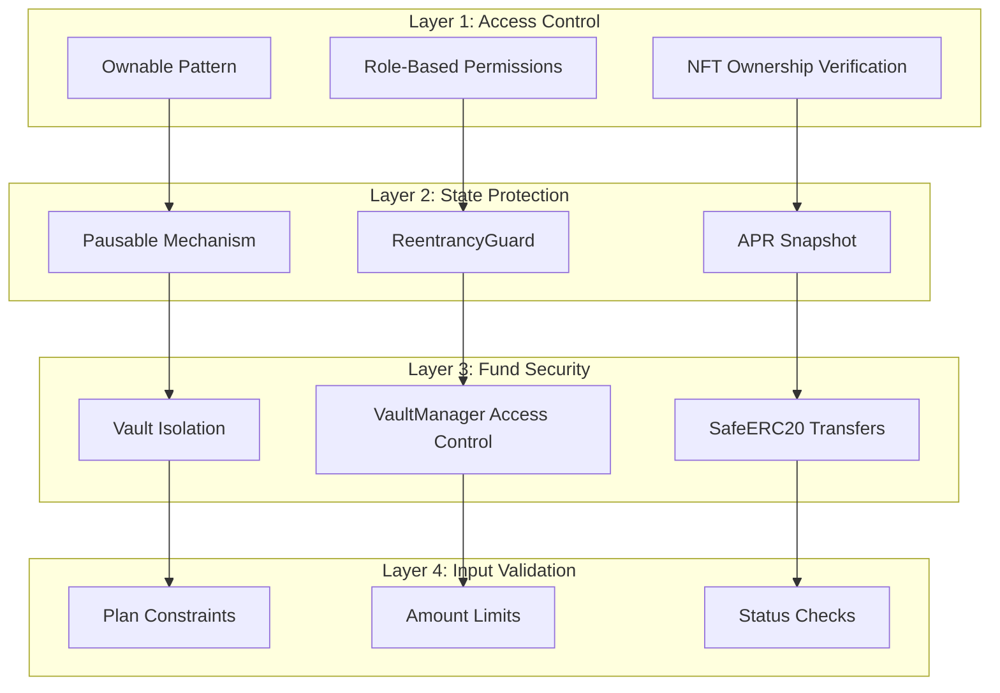
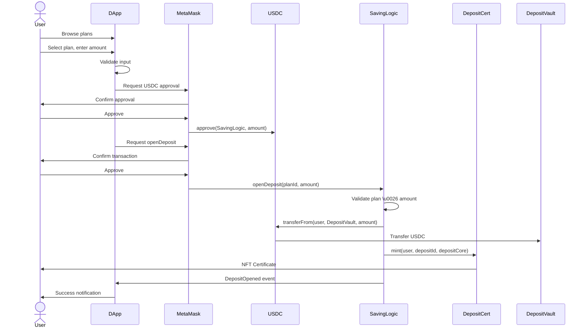
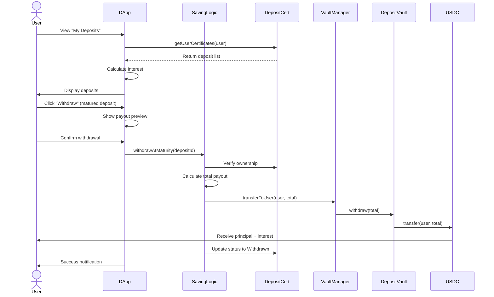
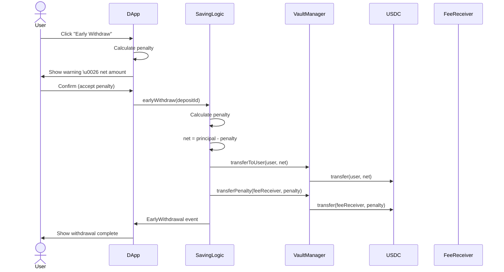
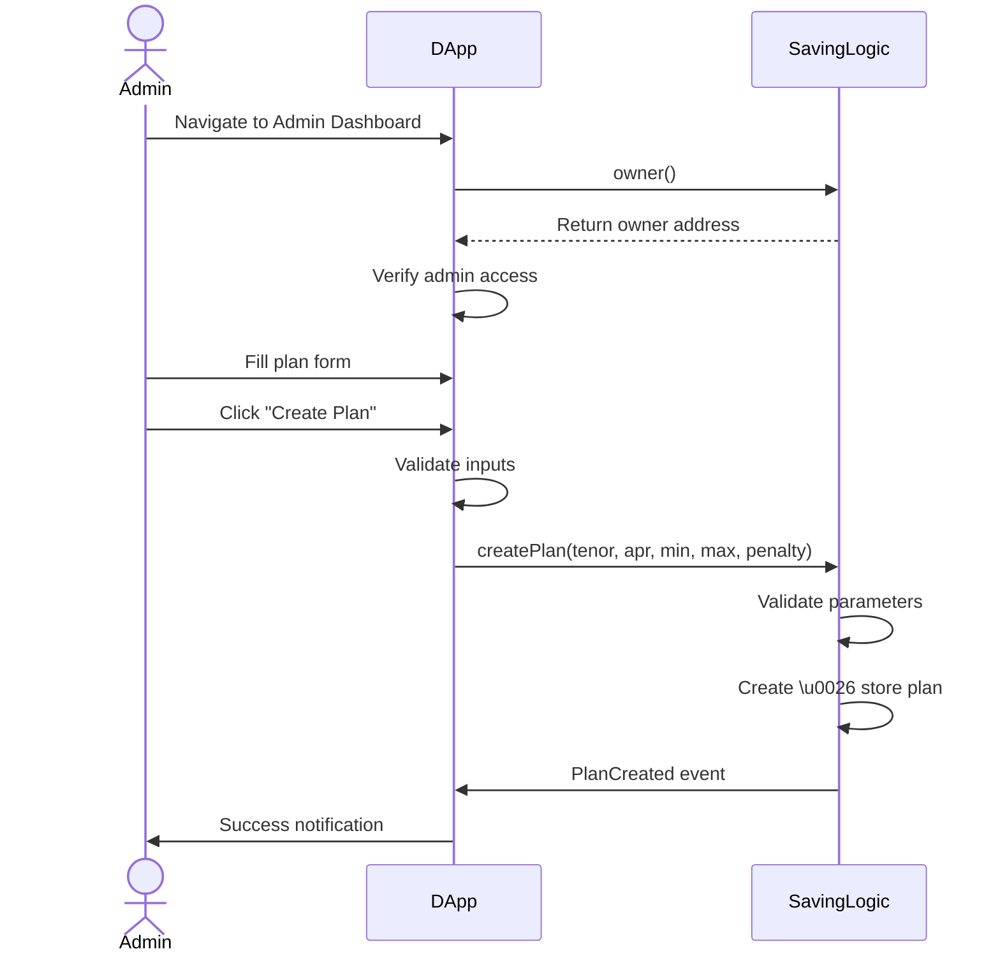

# 📊 SYSTEM OVERVIEW - TERM DEPOSIT DAPP

**Project Name:** Decentralized Term Deposit Savings Protocol  
**Version:** 2.0  
**Author:** Tran Anh Thu  
**Date:** January 31, 2026  
**Network:** Ethereum Sepolia Testnet

---

## 🎯 EXECUTIVE SUMMARY

### Business Problem

Traditional banking term deposits require trust in centralized institutions, involve opaque fee structures, and lack portability. Users cannot easily verify their deposit status, transfer ownership, or access their funds without bank approval.

### Solution

A fully decentralized term deposit protocol built on Ethereum that:
- ✅ Eliminates custodial risk through smart contracts
- ✅ Provides transparent, on-chain interest calculations
- ✅ Issues tradeable NFT certificates as proof of ownership
- ✅ Enables programmable, automated withdrawals
- ✅ Offers competitive fixed APR rates

### Key Metrics

| Metric | Value |
|--------|-------|
| **Total Contracts** | 5 core + 2 libraries |
| **Code Coverage** | 75 tests, 100% passing |
| **Gas Efficiency** | ~150k gas per deposit |
| **Security** | Pausable, ReentrancyGuard, Ownable |
| **NFT Standard** | ERC-721 with IPFS metadata |
| **Deployment** | Ethereum Sepolia (Production-ready) |

---

## 🏗️ SYSTEM ARCHITECTURE

### High-Level Overview

```
┌─────────────────────────────────────────────────────────────────┐
│                         USER LAYER                               │
│                      MetaMask Wallet                             │
└──────────────────────────┬──────────────────────────────────────┘
                           │
┌──────────────────────────▼──────────────────────────────────────┐
│                     FRONTEND LAYER                               │
│                                                                  │
│  ┌──────────────────────────────────────────────────────┐       │
│  │  React DApp (Vercel)                                 │       │
│  │  - User Interface                                    │       │
│  │  - Wallet Connection                                 │       │
│  │  - Contract Interaction (ethers.js)                  │       │
│  │  - Client-side SVG Generation (NFT Gallery)          │       │
│  └──────────────────────────────────────────────────────┘       │
└──────────────────────────┬──────────────────────────────────────┘
                           │ Web3 RPC
┌──────────────────────────▼──────────────────────────────────────┐
│                 BLOCKCHAIN LAYER (Sepolia)                       │
│                                                                  │
│  ┌────────────────┐  ┌────────────────┐  ┌──────────────────┐  │
│  │  SavingLogic   │  │ VaultManager   │  │ DepositCertificate│ │
│  │  (Business     │  │ (Interest Pool │  │ (ERC-721 NFT)    │ │
│  │   Logic)       │  │  Management)   │  │                  │ │
│  └───────┬────────┘  └───────┬────────┘  └────────┬─────────┘  │
│          │                   │                     │            │
│          │                   │                     │            │
│  ┌───────▼────────┐  ┌───────▼────────┐           │            │
│  │ DepositVault   │  │   MockUSDC     │◄──────────┘            │
│  │ (Principal     │  │   (ERC-20      │                        │
│  │  Storage)      │  │   Stablecoin)  │                        │
│  └────────────────┘  └────────────────┘                        │
│                                                                  │
│  Storage: Ethereum State (Plans, Deposits, NFT Ownership)       │
└──────────────────────────┬──────────────────────────────────────┘
                           │
┌──────────────────────────▼──────────────────────────────────────┐
│                  OFF-CHAIN SERVICES                              │
│                                                                  │
│  ┌──────────────────────────────────────────────────────┐       │
│  │  Metadata API (Vercel Serverless)                    │       │
│  │  - NFT Metadata Generation (ERC-721 standard)        │       │
│  │  - SVG Certificate Generation (on-demand)            │       │
│  │  - Serves tokenURI() for Etherscan/OpenSea           │       │
│  └──────────────────────────────────────────────────────┘       │
└──────────────────────────────────────────────────────────────────┘
```

### Component Breakdown

#### 1. Smart Contracts (Blockchain Layer)

**SavingLogic** - Core business logic
- Plan management (create, update, disable)
- Deposit lifecycle (open, withdraw, renew)
- Interest calculation with APR snapshot
- Penalty calculation for early withdrawal

**VaultManager** - Fund management
- Liquidity pool management
- Vault funding/withdrawal (admin only)
- Penalty fee collection and routing
- Emergency pause mechanism

**DepositCertificate** - NFT certificates
- ERC-721 token minting
- Deposit data storage
- Metadata URI management
- Ownership verification

**DepositVault** - USDC storage
- Isolated fund storage
- Secure transfer mechanisms
- Balance tracking

**MockUSDC** - Test stablecoin
- ERC-20 implementation
- 6 decimals (like real USDC)
- Faucet for testing

#### 2. Frontend (Application Layer)

**React DApp**
- User interface for all operations
- Wallet connection (MetaMask)
- Real-time balance updates
- Interest calculator
- Admin dashboard

**Metadata API (Vercel Serverless)**

The metadata API serves two purposes:

1. **Plan Metadata Storage (Off-chain)**
   - Stores plan descriptions, images, and marketing content
   - Reduces on-chain storage costs (gas optimization)
   - Provides rich plan information for frontend
   - Endpoints: `/api/plans/:planId`, `/api/plans`

2. **NFT Certificate Generation (On-demand)**
   - Generates ERC-721 compliant metadata JSON
   - Creates dynamic SVG certificates with deposit info
   - Serves `tokenURI()` for Etherscan/OpenSea
   - Stateless - no database required
   - Endpoints: `/api/metadata/:depositId`

#### 3. Storage (Data Layer)

**On-Chain Storage (Ethereum State)**
- Plan configurations (tenor, APR, limits)
- Deposit core data (principal, maturity, APR snapshot)
- NFT ownership mapping
- Deposit status tracking
- Transaction history (events)

---

## 🔐 SECURITY ARCHITECTURE

### Security Layers



### Access Control Matrix

| Role | Create Plan | Update Plan | Open Deposit | Withdraw | Fund Vault | Pause |
|------|------------|-------------|--------------|----------|------------|-------|
| **Owner** | ✅ | ✅ | ✅ | ✅ (if owns NFT) | ✅ | ✅ |
| **User** | ❌ | ❌ | ✅ | ✅ (if owns NFT) | ❌ | ❌ |
| **Contract** | ❌ | ❌ | ❌ | ❌ | ❌ | ❌ |

---

## 📊 USER FLOWS

### 1. Open Deposit Flow



**Steps:**
1. User browses available savings plans
2. Selects plan and enters deposit amount
3. Approves USDC spending
4. Confirms deposit transaction
5. Smart contract validates and processes
6. USDC transferred to vault
7. NFT certificate minted to user
8. Success notification displayed

**Time:** ~2-3 minutes (including confirmations)  
**Gas Cost:** ~150,000 gas

### 2. Withdraw at Maturity Flow



**Steps:**
1. User views deposits in "My Deposits"
2. System calculates current interest
3. User clicks "Withdraw" on matured deposit
4. Reviews payout amount (principal + interest)
5. Confirms withdrawal
6. Smart contract verifies ownership
7. Calculates final payout
8. Transfers USDC to user
9. Updates deposit status

**Time:** ~1-2 minutes  
**Gas Cost:** ~100,000 gas

### 3. Early Withdrawal Flow



**Steps:**
1. User clicks "Early Withdraw"
2. System calculates penalty (e.g., 20%)
3. Shows warning with net amount
4. User confirms and accepts penalty
5. Smart contract processes withdrawal
6. Transfers net amount to user
7. Transfers penalty to fee receiver
8. Updates deposit status

**Time:** ~1-2 minutes  
**Gas Cost:** ~120,000 gas  
**Penalty:** 20% of principal (configurable per plan)

### 4. Admin Create Plan Flow



**Steps:**
1. Admin navigates to dashboard
2. System verifies admin role
3. Admin fills plan configuration form
4. Submits plan creation
5. Smart contract validates parameters
6. Stores new plan on-chain
7. Emits PlanCreated event
8. Success notification

**Time:** ~1 minute  
**Gas Cost:** ~80,000 gas

---

## 💰 ECONOMICS \u0026 CALCULATIONS

### Interest Calculation

**Formula:**
```
interest = (principal × aprBps × durationSeconds) / (365 days × 10,000)
```

**Example:**
- Principal: 1,000 USDC
- APR: 500 bps (5%)
- Duration: 30 days (2,592,000 seconds)
- Interest: (1,000 × 500 × 2,592,000) / (31,536,000 × 10,000)
- **Result: 4.11 USDC**

### Penalty Calculation

**Formula:**
```
penalty = (principal × penaltyBps) / 10,000
netAmount = principal - penalty
```

**Example:**
- Principal: 1,000 USDC
- Penalty: 2,000 bps (20%)
- Penalty Amount: (1,000 × 2,000) / 10,000 = 200 USDC
- **Net Amount: 800 USDC**

### APR Basis Points

| Basis Points | Percentage | Example Annual Interest (1,000 USDC) |
|--------------|-----------|--------------------------------------|
| 100 bps | 1% | 10 USDC |
| 300 bps | 3% | 30 USDC |
| 500 bps | 5% | 50 USDC |
| 800 bps | 8% | 80 USDC |
| 1,200 bps | 12% | 120 USDC |

---

## 🎫 NFT CERTIFICATE SYSTEM

### NFT Architecture

Each deposit is represented by an ERC-721 NFT certificate that:
- ✅ Proves ownership of the deposit
- ✅ Can be transferred/traded
- ✅ Contains embedded deposit data
- ✅ Has beautiful SVG artwork
- ✅ Is viewable on Etherscan/OpenSea

### NFT Metadata Flow

```
Frontend Display (NFT Gallery):
User → NFT Gallery Component → Generate SVG (client-side) → Display in browser

Etherscan/OpenSea Display:
Etherscan → DepositCertificate.tokenURI(8) → Returns "https://api.vercel.app/metadata/8"
         → Metadata API → Generate SVG (server-side) → Return ERC-721 JSON
```

**Why Two Approaches?**
- **Client-side (Frontend)**: Fast, no API calls, works offline
- **Server-side (Metadata API)**: Required for Etherscan/OpenSea compatibility

### Certificate Design

**Visual Elements:**
- 🎨 Blue-to-purple gradient background
- ⭐ Award icon decoration
- 🔢 Unique certificate ID
- 📜 "Certificate of Ownership" text
- 🔐 "Secured on Ethereum Blockchain"
- 🏷️ ERC-721 Standard badge

**Metadata Structure:**
```json
{
  "name": "Term Deposit Certificate #8",
  "description": "Certificate of ownership for a term deposit...",
  "image": "data:image/svg+xml;base64,PHN2Zy4uLg==",
  "attributes": [
    { "trait_type": "Certificate ID", "value": "8" },
    { "trait_type": "Status", "value": "Active" }
  ]
}
```

---

## 🚀 DEPLOYMENT INFORMATION

### Sepolia Testnet Deployment

**Deployment Date:** January 30, 2026  
**Deployer Address:** `0x6b603229f119FE0a3F21487A2b0dBFd3c0Ea138A`

| Contract | Address | Etherscan |
|----------|---------|-----------|
| **MockUSDC** | `0x73a9bEc9B836007904A19C30B2FD9B2f7A6720BA` | [View](https://sepolia.etherscan.io/address/0x73a9bEc9B836007904A19C30B2FD9B2f7A6720BA) |
| **DepositCertificate** | `0x2A4A34e3C69D862e1dAA94C64C5747f022160AB4` | [View](https://sepolia.etherscan.io/address/0x2A4A34e3C69D862e1dAA94C64C5747f022160AB4) |
| **DepositVault** | `0x077a4941565e0194a00Cd8DABE1acA09111F7B06` | [View](https://sepolia.etherscan.io/address/0x077a4941565e0194a00Cd8DABE1acA09111F7B06) |
| **VaultManager** | `0xFf586ADCE68Ed8f0FcfbFA268Ba81E438900e136` | [View](https://sepolia.etherscan.io/address/0xFf586ADCE68Ed8f0FcfbFA268Ba81E438900e136) |
| **SavingLogic** | `0xddEDe5D9F4005C1e5f84Cda022DB7e558177FEAb` | [View](https://sepolia.etherscan.io/address/0xddEDe5D9F4005C1e5f84Cda022DB7e558177FEAb) |

### Live Applications

- **DApp:** [term-deposit-dapp.vercel.app](https://term-deposit-dapp.vercel.app)
- **Metadata API:** [term-deposit-api.vercel.app](https://term-deposit-api.vercel.app)

### Available Plans

| Plan ID | Tenor | APR | Min Deposit | Max Deposit | Penalty |
|---------|-------|-----|-------------|-------------|---------|
| 0 | 7 days | 3% | 10 USDC | 10,000 USDC | 20% |
| 1 | 30 days | 5% | 50 USDC | 50,000 USDC | 20% |
| 2 | 90 days | 8% | 100 USDC | 100,000 USDC | 20% |
| 3 | 180 days | 10% | 500 USDC | 500,000 USDC | 20% |
| 4 | 365 days | 12% | 1,000 USDC | 1,000,000 USDC | 20% |

---

## 📈 PERFORMANCE \u0026 SCALABILITY

### Gas Optimization

| Operation | Gas Used | Optimization Strategy |
|-----------|----------|----------------------|
| `openDeposit()` | ~150,000 | Minimal storage writes, struct packing |
| `withdrawAtMaturity()` | ~100,000 | Single USDC transfer |
| `earlyWithdraw()` | ~120,000 | Two transfers (user + fee) |
| `createPlan()` | ~80,000 | Efficient struct storage |

### Scalability Features

- ✅ **Event-based queries** - Efficient deposit retrieval without storage iteration
- ✅ **Pagination support** - Frontend handles large deposit lists
- ✅ **Stateless API** - Metadata API is horizontally scalable
- ✅ **IPFS backup** - Decentralized metadata redundancy
- ✅ **Indexed events** - Fast blockchain data queries

---

## ✅ TESTING \u0026 QUALITY ASSURANCE

### Test Coverage

| Test Suite | Tests | Coverage | Status |
|------------|-------|----------|--------|
| **MockUSDC** | 2 | 100% | ✅ |
| **SavingLogic** | 46 | \u003e95% | ✅ |
| **VaultManager** | 27 | \u003e90% | ✅ |
| **Total** | **75** | **\u003e90%** | **✅** |

### Test Categories

**Unit Tests:**
- Plan CRUD operations
- Deposit validation
- Interest calculations
- Penalty calculations
- NFT minting
- Access control

**Integration Tests:**
- End-to-end deposit flow
- Withdrawal flows (maturity \u0026 early)
- Vault funding \u0026 payouts
- Pause/unpause behavior

**Edge Cases:**
- Insufficient vault balance
- Plan constraints violations
- Invalid deposit states
- Reentrancy attempts
- Zero amounts

---

## 🎯 FUTURE ROADMAP

### Phase 1: Security \u0026 Optimization (Q1 2026)
- [ ] External security audit
- [ ] Gas optimization review
- [ ] Mainnet deployment preparation

### Phase 2: Feature Enhancements (Q2 2026)
- [ ] Compound interest option
- [ ] Flexible penalty tiers
- [ ] Auto-renewal feature
- [ ] Referral system

### Phase 3: Expansion (Q3 2026)
- [ ] Multi-token support (DAI, USDT)
- [ ] Governance token integration
- [ ] Cross-chain deployment (Polygon, Arbitrum)
- [ ] Mobile app

---

## 📚 DOCUMENTATION

### Available Documents

1. **[README.md](../README.md)** - Project overview \u0026 quick start
2. **[ARCHITECTURE.md](../term-deposit-dapp/ARCHITECTURE.md)** - Frontend architecture
3. **[contracts/ARCHITECTURE.md](../contracts/ARCHITECTURE.md)** - Smart contract architecture
4. **[NFT_FLOW_EXPLANATION.md](./nft_flow_explanation.md)** - NFT certificate flow
5. **[VERCEL_DEPLOYMENT_GUIDE.md](../VERCEL_DEPLOYMENT_GUIDE.md)** - Deployment guide
6. **[IPFS_DEPLOY_GUIDE.md](../IPFS_DEPLOY_GUIDE.md)** - IPFS metadata deployment

---

## 🏆 CONCLUSION

The Term Deposit DApp represents a production-ready decentralized savings protocol that successfully brings traditional banking features to the blockchain. Key achievements include:

### Technical Excellence
- ✅ **Robust Architecture** - Clean separation of concerns
- ✅ **Comprehensive Testing** - 75 tests with \u003e90% coverage
- ✅ **Security-First** - Multiple protection layers
- ✅ **Gas Optimized** - Efficient smart contract design

### User Experience
- ✅ **Intuitive Interface** - Easy-to-use React frontend
- ✅ **Real-time Updates** - Live balance \u0026 interest calculations
- ✅ **NFT Innovation** - Beautiful certificate design
- ✅ **Transparent** - All operations on-chain

### Production Readiness
- ✅ **Deployed \u0026 Verified** - Live on Sepolia testnet
- ✅ **Documented** - Comprehensive documentation
- ✅ **Tested** - Extensive test coverage
- ✅ **Scalable** - Ready for mainnet deployment

The system is ready for production use after a professional security audit.

---

**Document Version:** 1.0  
**Last Updated:** January 31, 2026  
**Author:** Tran Anh Thu  
**Contact:** trananhthu270904@gmail.com

---

*This document provides a comprehensive overview of the Term Deposit DApp system. For detailed technical specifications, please refer to the architecture documents for [Frontend](../term-deposit-dapp/ARCHITECTURE.md) and [Smart Contracts](../contracts/ARCHITECTURE.md).*
