# 🏗️ SYSTEM ARCHITECTURE - TERM DEPOSIT DAPP

**Version:** 2.0  
**Last Updated:** January 31, 2026  
**Network:** Ethereum Sepolia Testnet  
**Status:** ✅ Production-Ready

---

## 📋 TABLE OF CONTENTS

1. [Executive Summary](#executive-summary)
2. [High-Level Architecture](#high-level-architecture)
3. [Smart Contract Architecture](#smart-contract-architecture)
4. [Frontend Architecture](#frontend-architecture)
5. [Security Architecture](#security-architecture)
6. [Data Flow \u0026 Interactions](#data-flow--interactions)
7. [Sequence Diagrams](#sequence-diagrams)
8. [NFT Certificate System](#nft-certificate-system)
9. [Deployment Architecture](#deployment-architecture)

---

## 📊 EXECUTIVE SUMMARY

### Business Overview

The Term Deposit DApp is a decentralized savings protocol that brings traditional banking term deposit features to the blockchain. Users can lock USDC stablecoins into fixed-term savings plans, earn competitive interest rates, and receive ERC-721 NFT certificates as proof of ownership.

### Key Metrics

| Metric | Value |
|--------|-------|
| **Smart Contracts** | 4 core contracts + 3 libraries |
| **Test Coverage** | 75 tests, 100% passing |
| **Deployment Network** | Ethereum Sepolia Testnet |
| **Frontend Framework** | React 18.3.1 + TypeScript |
| **NFT Standard** | ERC-721 with IPFS metadata |
| **Security Features** | Pausable, Ownable, ReentrancyGuard |

### Core Value Propositions

- 🎫 **NFT-Based Ownership** - Each deposit is a tradeable ERC-721 token
- 💰 **Fixed APR** - Interest rates locked at deposit creation
- 🔒 **Vault Separation** - User funds isolated from operational logic
- 📊 **Transparent** - All operations on-chain and verifiable
- 🌐 **Decentralized** - No custodial risk, smart contract-based

---

## 🏗️ HIGH-LEVEL ARCHITECTURE

### System Components

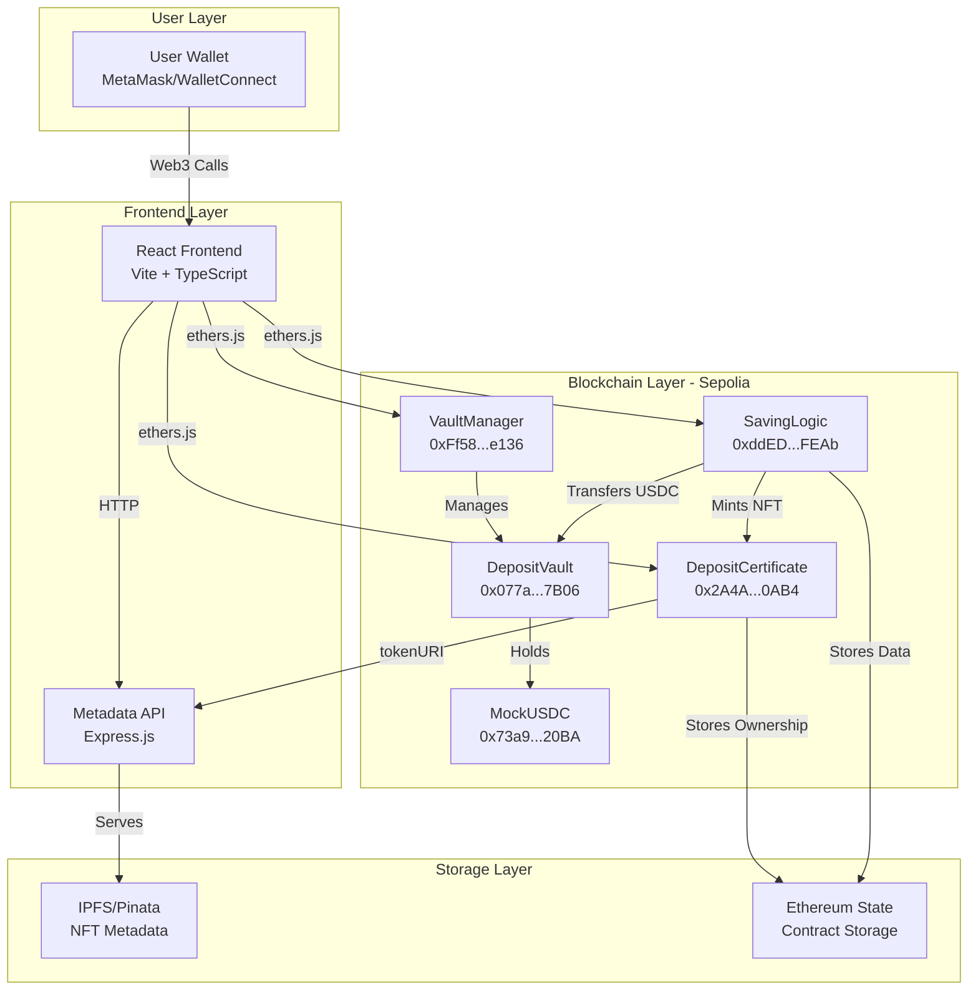

### Technology Stack

#### Smart Contracts
- **Language:** Solidity 0.8.28
- **Framework:** Hardhat
- **Libraries:** OpenZeppelin (ERC20, ERC721, Ownable, Pausable, ReentrancyGuard)
- **Testing:** Chai/Mocha (75 tests)
- **Type Safety:** Typechain

#### Frontend
- **Framework:** React 18.3.1
- **Language:** TypeScript 5.6.2
- **Build Tool:** Vite
- **Web3 Library:** ethers.js 6.16.0
- **Styling:** Sass/SCSS
- **State Management:** React Context API

#### Infrastructure
- **Blockchain:** Ethereum Sepolia Testnet
- **NFT Storage:** IPFS via Pinata
- **Frontend Hosting:** Vercel
- **API Hosting:** Vercel Serverless Functions

---

## 🔐 SMART CONTRACT ARCHITECTURE

### Contract Hierarchy

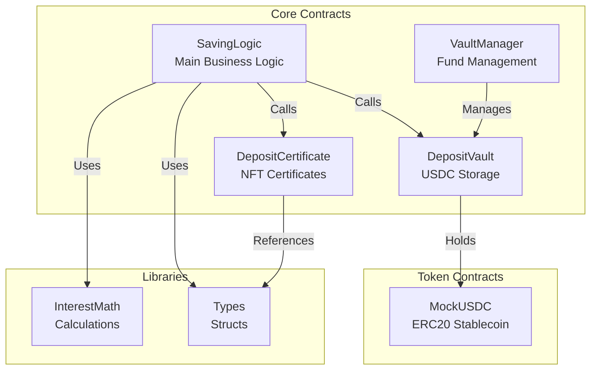

### 1. SavingLogic Contract

**Address:** `0xddEDe5D9F4005C1e5f84Cda022DB7e558177FEAb`

**Purpose:** Core business logic for term deposit operations

**Key Responsibilities:**
- ✅ Plan management (create, update, disable)
- ✅ Deposit lifecycle (open, withdraw, renew)
- ✅ Interest calculation with APR snapshot
- ✅ Penalty calculation for early withdrawal
- ✅ NFT certificate minting coordination

**State Variables:**
```solidity
struct Plan {
    uint256 tenorSeconds;        // Lock period (e.g., 30 days)
    uint256 aprBps;              // Annual percentage rate (basis points)
    uint256 minDeposit;          // Minimum deposit amount
    uint256 maxDeposit;          // Maximum deposit amount
    uint256 penaltyBps;          // Early withdrawal penalty
    bool isActive;               // Plan enabled/disabled
}

struct DepositCore {
    uint256 depositId;           // Unique deposit ID
    address owner;               // Deposit owner
    uint256 planId;              // Associated plan
    uint256 principal;           // Deposit amount
    uint256 aprBpsAtOpen;        // APR snapshot
    uint256 penaltyBpsAtOpen;    // Penalty snapshot
    uint256 startAt;             // Deposit creation time
    uint256 maturityAt;          // Maturity timestamp
    DepositStatus status;        // Active/Withdrawn/Renewed
}
```

**Access Control:**
- `onlyOwner`: createPlan, updatePlan, setPaused
- `whenNotPaused`: openDeposit, withdrawAtMaturity, earlyWithdraw
- Public: getPlan, getDeposit, getUserDeposits

### 2. VaultManager Contract

**Address:** `0xFf586ADCE68Ed8f0FcfbFA268Ba81E438900e136`

**Purpose:** Manage liquidity pool and fund flows

**Key Responsibilities:**
- ✅ Vault funding (admin deposits USDC)
- ✅ Vault withdrawals (admin extracts excess)
- ✅ Penalty fee collection and routing
- ✅ Emergency pause mechanism
- ✅ Balance tracking and reporting

**State Variables:**
```solidity
address public depositVault;     // DepositVault contract address
address public feeReceiver;      // Penalty recipient address
uint256 public totalPenalties;   // Accumulated penalties
bool public paused;              // Emergency pause state
```

**Access Control:**
- `onlyOwner`: fundVault, withdrawFromVault, setFeeReceiver, pause, unpause
- `onlySavingLogic`: transferToUser (internal calls only)

### 3. DepositCertificate Contract

**Address:** `0x2A4A34e3C69D862e1dAA94C64C5747f022160AB4`

**Purpose:** ERC-721 NFT certificates for deposits

**Key Responsibilities:**
- ✅ Mint NFT when deposit is created
- ✅ Store deposit core data on-chain
- ✅ Provide metadata URI for NFT marketplaces
- ✅ Ownership verification

**State Variables:**
```solidity
string private _baseTokenURI;                    // Metadata API base URL
mapping(uint256 => DepositCore) _depositCores;   // Token ID → Deposit data
```

**Key Functions:**
```solidity
function mint(address to, uint256 depositId, DepositCore memory depositCore) external onlySavingLogic
function tokenURI(uint256 tokenId) public view returns (string memory)
function getDepositCore(uint256 depositId) external view returns (DepositCore memory)
function setBaseURI(string memory newBaseURI) external onlyOwner
```

### 4. DepositVault Contract

**Address:** `0x077a4941565e0194a00Cd8DABE1acA09111F7B06`

**Purpose:** Isolated USDC storage vault

**Key Responsibilities:**
- ✅ Hold user deposits
- ✅ Accept deposits from users
- ✅ Transfer funds to users (via VaultManager only)
- ✅ Balance tracking

**Access Control:**
- `onlyVaultManager`: withdraw (only VaultManager can move funds)
- Public: deposit (anyone can deposit, but funds go to vault)

### 5. MockUSDC Contract

**Address:** `0x73a9bEc9B836007904A19C30B2FD9B2f7A6720BA`

**Purpose:** Test stablecoin for Sepolia testnet

**Features:**
- ✅ Standard ERC-20 implementation
- ✅ 6 decimals (like real USDC)
- ✅ 1,000,000 USDC initial supply
- ✅ Faucet function for testing

---

## 💻 FRONTEND ARCHITECTURE

### Component Structure

```
term-deposit-dapp/
├── src/
│   ├── components/
│   │   ├── common/              # Reusable UI components
│   │   │   ├── Button/
│   │   │   ├── Card/
│   │   │   ├── Header/
│   │   │   ├── Footer/
│   │   │   └── Modal/
│   │   ├── user/                # User-facing features
│   │   │   ├── Plans/           # Browse savings plans
│   │   │   ├── OpenDeposit/     # Create new deposit
│   │   │   ├── MyDeposits/      # View user deposits
│   │   │   ├── NFTGallery/      # NFT certificate gallery
│   │   │   └── Calculator/      # Interest calculator
│   │   └── admin/               # Admin dashboard
│   │       ├── PlanManagement/
│   │       ├── VaultManagement/
│   │       └── SystemStats/
│   ├── context/
│   │   ├── WalletContext.tsx    # Wallet connection state
│   │   └── ContractContext.tsx  # Contract instances
│   ├── hooks/
│   │   ├── usePlans.ts          # Plan operations
│   │   ├── useDeposit.ts        # Deposit operations
│   │   ├── useNFT.ts            # NFT operations
│   │   ├── useBalance.ts        # Balance queries
│   │   └── useAdmin.ts          # Admin operations
│   ├── services/
│   │   ├── dataAggregator.ts    # Aggregate blockchain data
│   │   └── contractService.ts   # Contract interaction layer
│   ├── utils/
│   │   ├── formatters.ts        # Number/date formatting
│   │   ├── calculator.ts        # Interest calculations
│   │   └── time.ts              # Time utilities
│   └── types/
│       └── index.ts             # TypeScript interfaces
```

### Context Architecture

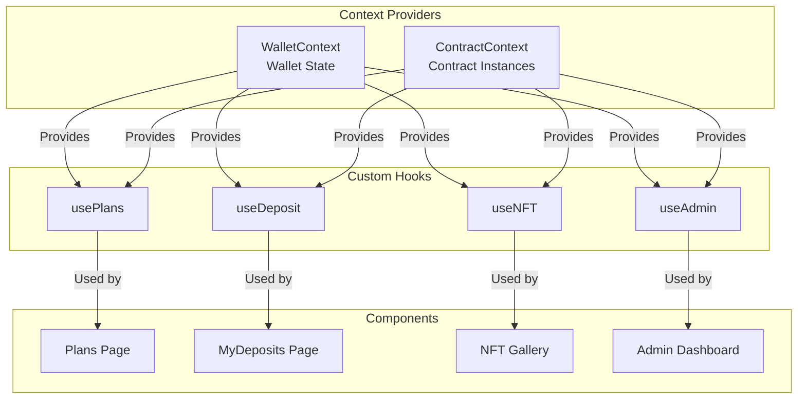

### State Management

**WalletContext State:**
```typescript
{
  address: string | null,           // Connected wallet address
  chainId: number | null,           // Network chain ID
  balance: string,                  // ETH balance
  isConnected: boolean,             // Connection status
  provider: BrowserProvider | null, // ethers.js provider
  connectWallet: () => Promise<void>,
  disconnectWallet: () => void
}
```

**ContractContext State:**
```typescript
{
  savingLogicContract: Contract | null,
  vaultManagerContract: Contract | null,
  depositCertificateContract: Contract | null,
  depositVaultContract: Contract | null,
  usdcContract: Contract | null,
  provider: BrowserProvider | null
}
```

---

## 🔒 SECURITY ARCHITECTURE

### Access Control Matrix

| Function | User | Admin | Contract |
|----------|------|-------|----------|
| **SavingLogic** | | | |
| `createPlan()` | ❌ | ✅ | ❌ |
| `updatePlan()` | ❌ | ✅ | ❌ |
| `openDeposit()` | ✅ | ✅ | ❌ |
| `withdrawAtMaturity()` | ✅ (owner) | ✅ (owner) | ❌ |
| `earlyWithdraw()` | ✅ (owner) | ✅ (owner) | ❌ |
| **VaultManager** | | | |
| `fundVault()` | ❌ | ✅ | ❌ |
| `withdrawFromVault()` | ❌ | ✅ | ❌ |
| `pause()` / `unpause()` | ❌ | ✅ | ❌ |
| `transferToUser()` | ❌ | ❌ | ✅ (SavingLogic) |
| **DepositCertificate** | | | |
| `mint()` | ❌ | ❌ | ✅ (SavingLogic) |
| `setBaseURI()` | ❌ | ✅ | ❌ |
| `tokenURI()` | ✅ | ✅ | ✅ |

### Security Mechanisms

#### 1. Ownership Protection
```solidity
// Only deposit owner can withdraw
modifier onlyDepositOwner(uint256 depositId) {
    require(
        depositCertificate.ownerOf(depositId) == msg.sender,
        "Not deposit owner"
    );
    _;
}
```

#### 2. Pausable Pattern
```solidity
// Emergency pause for critical bugs
function pause() external onlyOwner {
    _pause();
}

function unpause() external onlyOwner {
    _unpause();
}
```

#### 3. Reentrancy Protection
```solidity
// Prevents reentrancy attacks
function withdrawAtMaturity(uint256 depositId) 
    external 
    nonReentrant 
    whenNotPaused 
{
    // ... withdrawal logic
}
```

#### 4. APR Snapshot Protection
```solidity
// APR locked at deposit creation
depositCore.aprBpsAtOpen = plans[planId].aprBps;
// Admin changes to plan don't affect existing deposits
```

#### 5. Vault Separation
```
User Funds (DepositVault) ≠ Operational Logic (SavingLogic)
```
- Funds stored in separate contract
- Only VaultManager can move funds
- SavingLogic cannot directly access vault

### Threat Model

| Threat | Mitigation | Status |
|--------|------------|--------|
| **Reentrancy Attack** | ReentrancyGuard modifier | ✅ |
| **Unauthorized Withdrawal** | ownerOf() check | ✅ |
| **APR Manipulation** | Snapshot at deposit open | ✅ |
| **Vault Drain** | onlyVaultManager modifier | ✅ |
| **Emergency Exploit** | Pausable pattern | ✅ |
| **Integer Overflow** | Solidity 0.8+ built-in checks | ✅ |
| **Front-running** | Not applicable (no price oracle) | N/A |

---

## 🔄 DATA FLOW \u0026 INTERACTIONS

### Contract Interaction Diagram

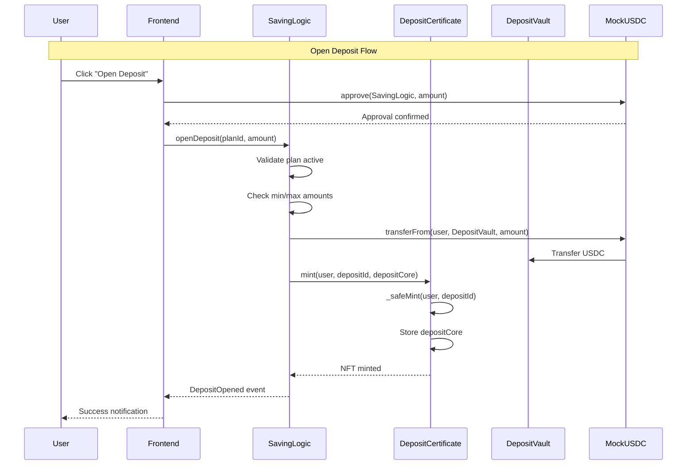

### Read Operations Flow

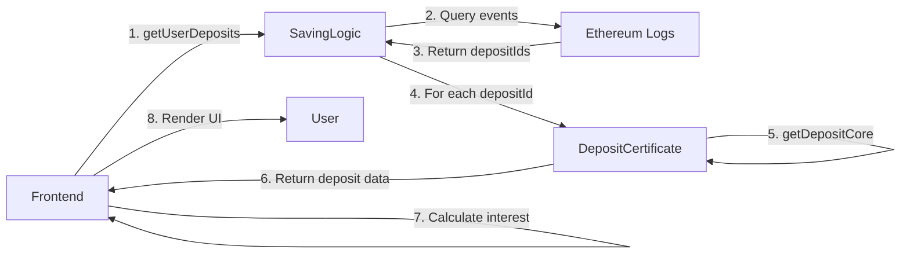

---

## 📊 SEQUENCE DIAGRAMS

### 1. Open Deposit Sequence

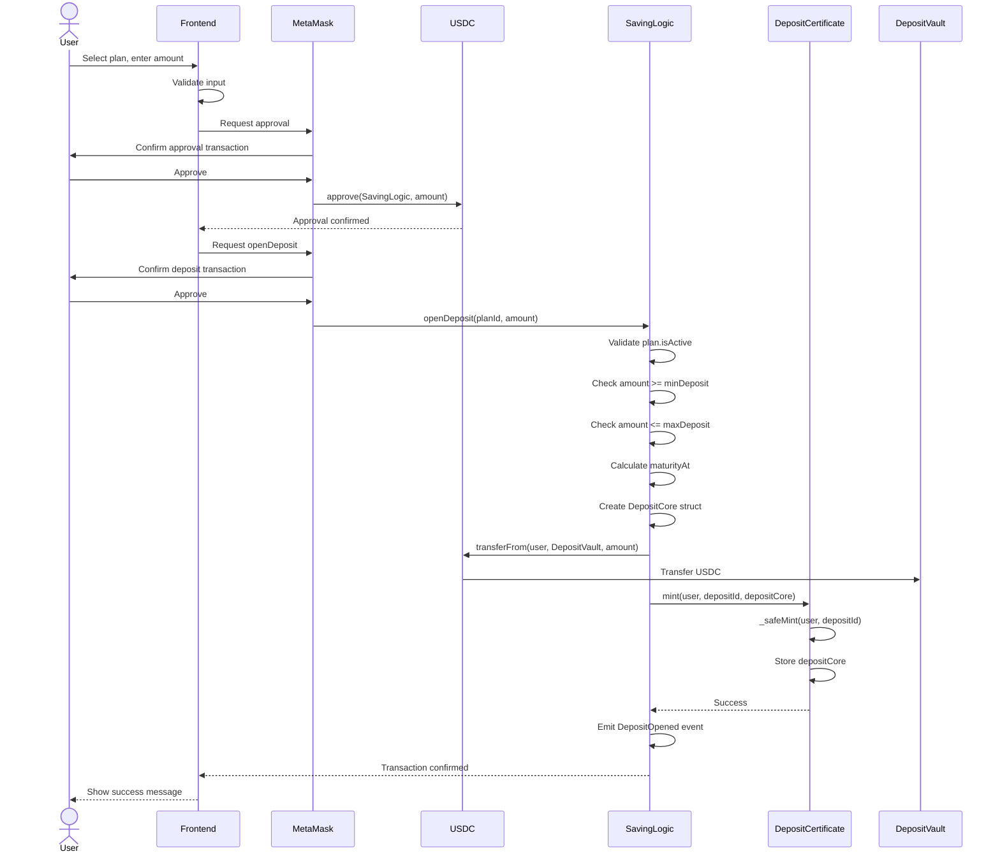

### 2. Withdraw at Maturity Sequence

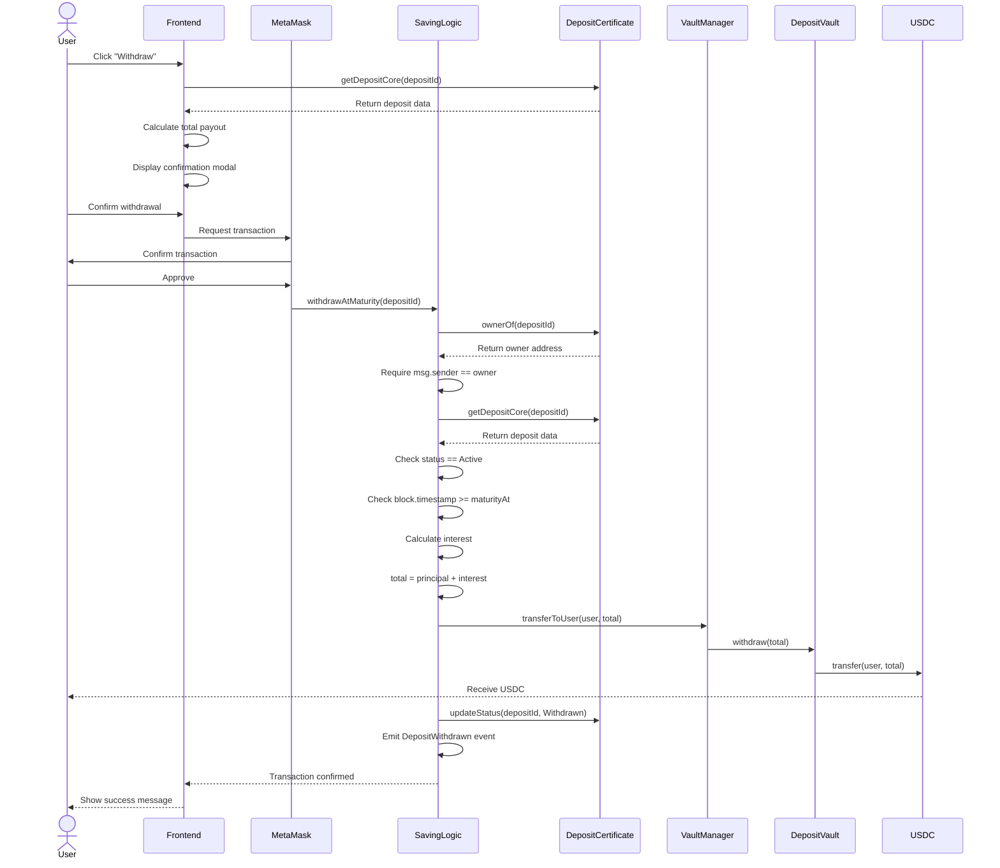

### 3. Early Withdraw Sequence

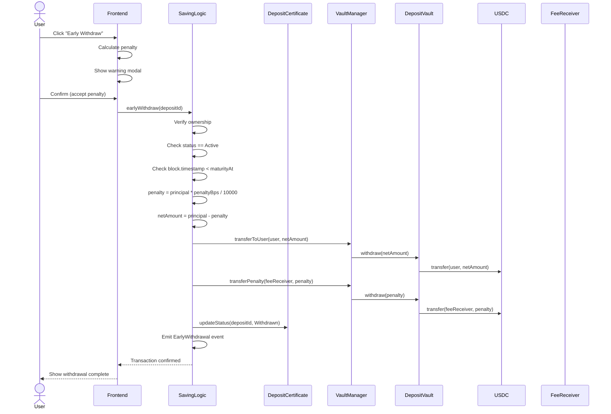

### 4. Admin Create Plan Sequence

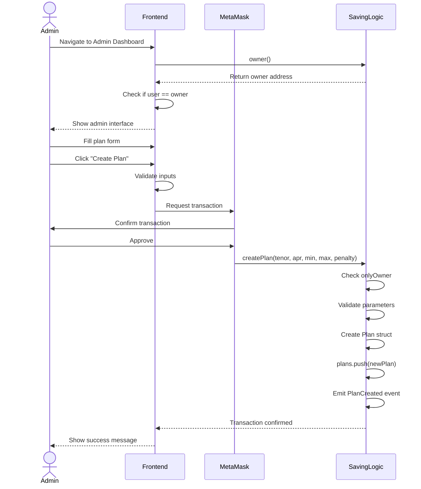

### 5. NFT Metadata Flow

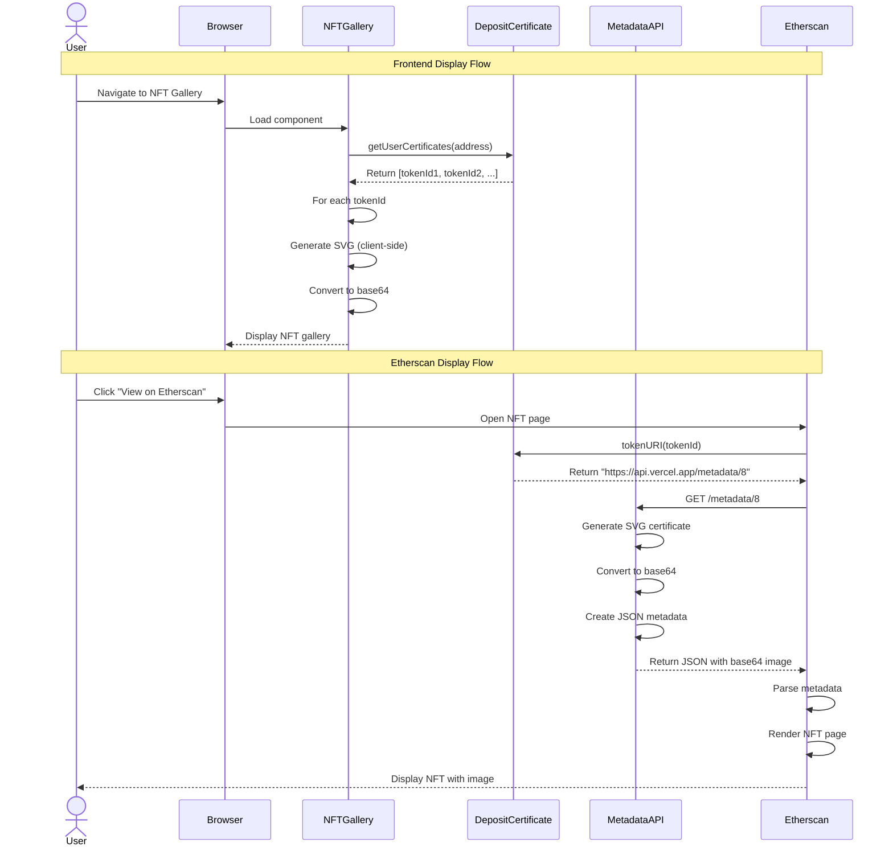

---

## 🎫 NFT CERTIFICATE SYSTEM

### NFT Architecture

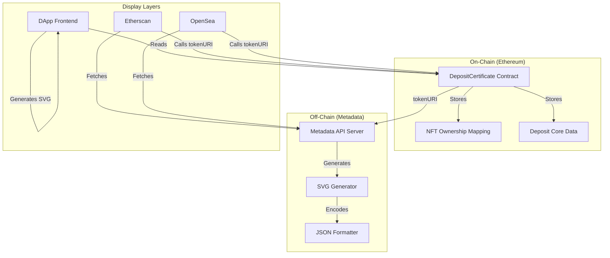

### Metadata Structure

**ERC-721 Standard Metadata:**
```json
{
  "name": "Term Deposit Certificate #8",
  "description": "Certificate of ownership for a term deposit in the decentralized savings protocol. This NFT represents your deposit and can be used as proof of ownership.",
  "image": "data:image/svg+xml;base64,PHN2Zy4uLg==",
  "external_url": "https://term-deposit-dapp.vercel.app/nft-gallery",
  "attributes": [
    { "trait_type": "Certificate ID", "value": "8" },
    { "trait_type": "Type", "value": "Savings Certificate" },
    { "trait_type": "Status", "value": "Active" },
    { "trait_type": "Standard", "value": "ERC-721" }
  ]
}
```

### SVG Certificate Design

```svg
<svg xmlns="http://www.w3.org/2000/svg" viewBox="0 0 400 500">
  <defs>
    <linearGradient id="grad" x1="0%" y1="0%" x2="100%" y2="100%">
      <stop offset="0%" style="stop-color:#0ea5e9;stop-opacity:1" />
      <stop offset="100%" style="stop-color:#8b5cf6;stop-opacity:1" />
    </linearGradient>
  </defs>
  <rect width="400" height="500" fill="url(#grad)"/>
  <!-- Certificate content -->
  <text x="200" y="200" font-size="28" fill="white" text-anchor="middle">
    CERTIFICATE
  </text>
  <text x="200" y="320" font-size="24" fill="white" text-anchor="middle">
    #8
  </text>
</svg>
```

---

## 🌐 DEPLOYMENT ARCHITECTURE

### Network Topology

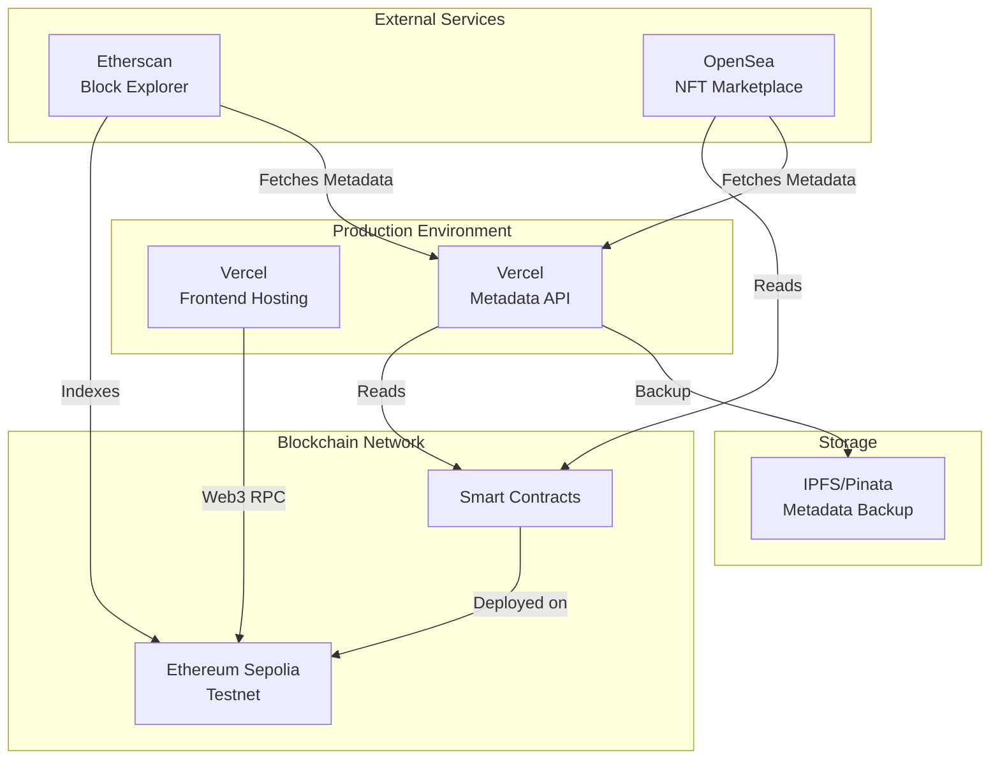

### Deployment Addresses (Sepolia)

| Contract | Address | Verification |
|----------|---------|--------------|
| **MockUSDC** | `0x73a9bEc9B836007904A19C30B2FD9B2f7A6720BA` | [✅ Verified](https://sepolia.etherscan.io/address/0x73a9bEc9B836007904A19C30B2FD9B2f7A6720BA) |
| **DepositCertificate** | `0x2A4A34e3C69D862e1dAA94C64C5747f022160AB4` | [✅ Verified](https://sepolia.etherscan.io/address/0x2A4A34e3C69D862e1dAA94C64C5747f022160AB4) |
| **DepositVault** | `0x077a4941565e0194a00Cd8DABE1acA09111F7B06` | [✅ Verified](https://sepolia.etherscan.io/address/0x077a4941565e0194a00Cd8DABE1acA09111F7B06) |
| **VaultManager** | `0xFf586ADCE68Ed8f0FcfbFA268Ba81E438900e136` | [✅ Verified](https://sepolia.etherscan.io/address/0xFf586ADCE68Ed8f0FcfbFA268Ba81E438900e136) |
| **SavingLogic** | `0xddEDe5D9F4005C1e5f84Cda022DB7e558177FEAb` | [✅ Verified](https://sepolia.etherscan.io/address/0xddEDe5D9F4005C1e5f84Cda022DB7e558177FEAb) |

### Environment Configuration

**Smart Contracts (.env):**
```bash
SEPOLIA_RPC_URL=https://eth-sepolia.g.alchemy.com/v2/YOUR_KEY
TESTNET_PRIVATE_KEY=0x...
ETHERSCAN_API_KEY=YOUR_ETHERSCAN_API_KEY
```

**Frontend (.env in term-deposit-dapp/):**
```bash
VITE_CHAIN_ID=11155111
VITE_RPC_URL=https://ethereum-sepolia-rpc.publicnode.com
VITE_MOCK_USDC_ADDRESS=0x73a9bEc9B836007904A19C30B2FD9B2f7A6720BA
VITE_DEPOSIT_CERTIFICATE_ADDRESS=0x2A4A34e3C69D862e1dAA94C64C5747f022160AB4
VITE_DEPOSIT_VAULT_ADDRESS=0x077a4941565e0194a00Cd8DABE1acA09111F7B06
VITE_VAULT_MANAGER_ADDRESS=0xFf586ADCE68Ed8f0FcfbFA268Ba81E438900e136
VITE_SAVING_LOGIC_ADDRESS=0xddEDe5D9F4005C1e5f84Cda022DB7e558177FEAb
```

---

## 📈 PERFORMANCE \u0026 SCALABILITY

### Gas Optimization

| Operation | Estimated Gas | Optimization |
|-----------|---------------|--------------|
| `openDeposit()` | ~150,000 | ✅ Minimal storage writes |
| `withdrawAtMaturity()` | ~100,000 | ✅ Single USDC transfer |
| `earlyWithdraw()` | ~120,000 | ✅ Two transfers (user + fee) |
| `createPlan()` | ~80,000 | ✅ Struct packing |

### Scalability Considerations

- ✅ **Event-based queries** - Efficient deposit retrieval without iterating storage
- ✅ **Pagination support** - Frontend can handle large deposit lists
- ✅ **Stateless metadata API** - Horizontally scalable
- ✅ **IPFS backup** - Decentralized metadata redundancy

---

## 🎯 CONCLUSION

This architecture provides a robust, secure, and scalable foundation for a decentralized term deposit protocol. Key strengths include:

1. **Security-First Design** - Multiple layers of access control and protection
2. **Modular Architecture** - Clear separation of concerns
3. **NFT Innovation** - Tradeable deposit certificates
4. **User Experience** - Intuitive frontend with real-time updates
5. **Production-Ready** - Comprehensive testing and deployment

The system is ready for production use on Ethereum testnets and can be deployed to mainnet after a professional security audit.

---

**Document Version:** 2.0  
**Last Updated:** January 31, 2026  
**Maintained By:** Tran Anh Thu
